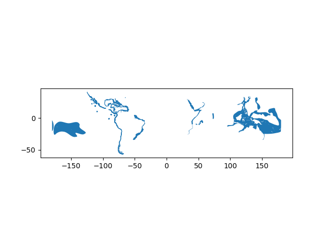
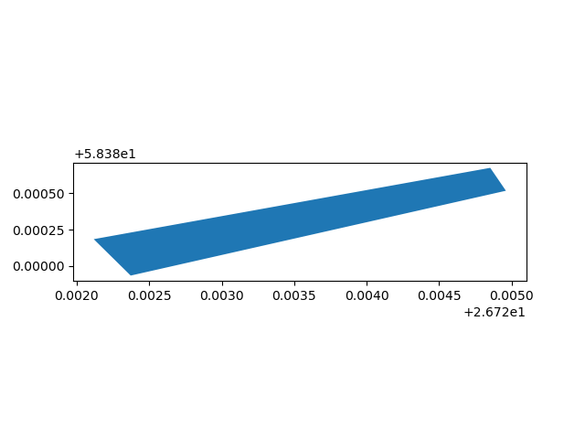

Introduction to Geopandas
=========================

Downloading data
----------------

For this lesson we are using data that you can download from `here <../_static/data/L2/damselfish-data.zip>`_.
Once you have downloaded the damselfish-data.zip file into your ``geopython2019`` directory (ideally under **L2**), you can unzip the file using e.g. 7Zip (on Windows).

 .. code::

    DAMSELFISH_distributions.dbf   DAMSELFISH_distributions.prj
    DAMSELFISH_distributions.sbn   DAMSELFISH_distributions.sbx
    DAMSELFISH_distributions.shp   DAMSELFISH_distributions.shp.xml
    DAMSELFISH_distributions.shx

The data includes a Shapefile called **DAMSELFISH_distribution.shp** (and files related to it).

Reading a Shapefile
-------------------

Spatial data can be read easily with geopandas using ``gpd.from_file()`` -function:

.. ipython:: python

    @suppress
    import gdal
    
    # Import necessary module
    import geopandas as gpd

    # Set filepath relative to your ``geopython2019`` working directory, from where your Jupyter Notebook or spyder also should be started
    fp = "source/_static/data/L2/DAMSELFISH_distributions.shp"

    # depending if you have your notebook file (.ipynb) also under L1 
    # fp = "DAMSELFISH_distributions.shp"

    # or full path for Windows with "r" and "\" backslashes
    # fp = r"C:\Users\Alex\geopython2019\L2\DAMSELFISH_distributions.shp"

    # Read file using gpd.read_file()
    data = gpd.read_file(fp)

Let's see what datatype is our 'data' variable

.. ipython:: python

   type(data)

So from the above we can see that our ``data`` -variable is a
**GeoDataFrame**. GeoDataFrame extends the functionalities of
**pandas.DataFrame** in a way that it is possible to use and handle
spatial data within pandas (hence the name geopandas). GeoDataFrame have
some special features and functions that are useful in GIS.

Let's take a look at our data and print the first 5 rows using the ``head()`` -function prints the first 5 rows by default

.. ipython:: python

    data.head()

Let's also take a look how our data looks like on a map. If you just
want to explore your data on a map, you can use ``.plot()`` -function
in geopandas that creates a simple map out of the data (uses
matplotlib as a backend):

 .. code:: python

    # import matplotlib and make it show plots directly (inline) in Jupyter notebooks
    import matplotlib.pyplot as plt
    %matplotlib inline

.. ipython:: python

    @savefig damselfish.png width=5in
    data.plot();

Writing a Shapefile
-------------------

Writing a new Shapefile is also something that is needed frequently.

Let's select 50 first rows of the input data and write those into a
new Shapefile by first selecting the data using index slicing and
then write the selection into a Shapefile with the ``gpd.to_file()`` -function:

.. code:: python

    # Create a output path for the data
    out_file_path = r"Data\DAMSELFISH_distributions_SELECTION.shp"

    # Select first 50 rows, this a the numpy/pandas syntax to ``slice`` parts out a dataframe or array, from position 0 until (excluding) 50
    selection = data[0:50]

    # Write those rows into a new Shapefile (the default output file format is Shapefile)
    selection.to_file(out_file_path)

**Task:** Open the Shapefile now in QGIS (or ArcGIS) on
your computer, and see how the data looks like.

Geometries in Geopandas
-----------------------

Geopandas takes advantage of Shapely's geometric objects. Geometries are typically
stored in a column called *geometry* (or geom). This is a default column name for
storing geometric information in geopandas.

Let's print the first 5 rows of the column 'geometry':

.. ipython:: python

    # It is possible to use only specific columns by specifying the column name within square brackets []
    data['geometry'].head()

Since spatial data is stored as Shapely objects, **it is possible to use
all of the functionalities of Shapely module** that we practiced
earlier.

Let's print the areas of the first 5 polygons:

.. ipython:: python

    # Make a selection that contains only the first five rows
    selection = data[0:5]

We can iterate over the selected rows using a specific ``.iterrows()`` -function in (geo)pandas and print the area for each polygon:

.. ipython:: python

    for index, row in selection.iterrows():
        # Calculate the area of the polygon
        poly_area = row['geometry'].area
        # Print information for the user
        print("Polygon area at index {0} is: {1:.3f}".format(index, poly_area))

Hence, as you might guess from here, all the functionalities of **Pandas** are available directly in
Geopandas without the need to call pandas separately because Geopandas is an **extension** for Pandas.

Let's next create a new column into our GeoDataFrame where we calculate and store the areas individual polygons. Calculating the areas of polygons is really easy in geopandas by using ``GeoDataFrame.area`` attribute:

.. ipython:: python

    data['area'] = data.area

Let's see the first 2 rows of our 'area' column.

.. ipython:: python

    data['area'].head(2)

So we can see that the area of our first polygon seems to be 19.39 and 6.14 for the second polygon.
They correspond to the ones we saw in previous step when iterating rows, hence, everything seems to work as it should.
Let's check what is the min and the max of those areas using familiar functions from our previous Pandas lessions.

.. ipython:: python

    # Maximum area
    max_area = data['area'].max()

    # Mean area
    mean_area = data['area'].mean()

    print("Max area: {:.2f}\nMean area: {:.2f}".format(round(max_area, 2), round(mean_area, 2)))

So the largest Polygon in our dataset seems to be 1494 square decimal degrees (~ 165 000 km2) and the average size is ~20 square decimal degrees (~2200 km2).

Creating geometries into a GeoDataFrame
---------------------------------------

Since geopandas takes advantage of Shapely geometric objects it is
possible to create a Shapefile from a scratch by passing Shapely's
geometric objects into the GeoDataFrame. This is useful as it makes it
easy to convert e.g. a text file that contains coordinates into a
Shapefile.

Let's create an empty ``GeoDataFrame``.

.. code:: python

    # Import necessary modules first
    import pandas as pd
    import geopandas as gpd
    from shapely.geometry import Point, Polygon
    import fiona

    # Create an empty geopandas GeoDataFrame
    newdata = gpd.GeoDataFrame()

.. ipython:: python
   :suppress:

    # Import necessary modules first
    import pandas as pd
    import geopandas as gpd
    from shapely.geometry import Point, Polygon
    import fiona

    # Create an empty geopandas GeoDataFrame
    newdata = gpd.GeoDataFrame()

.. ipython:: python

    # Let's see what's inside
    newdata

The GeoDataFrame is empty since we haven't placed any data inside.

Let's create a new column called ``geometry`` that will contain our Shapely objects:

.. ipython:: python

    # Create a new column called 'geometry' to the GeoDataFrame
    newdata['geometry'] = None

    # Let's see what's inside
    newdata

Now we have a geometry column in our GeoDataFrame but we don't have any
data yet.

Let's create a Shapely Polygon representing the Tartu Townhall square that we can insert to our GeoDataFrame:

.. ipython:: python

    # Coordinates of the Tartu Townhall square in Decimal Degrees
    coordinates = [(26.722117, 58.380184), (26.724853, 58.380676), (26.724961, 58.380518), (26.722372, 58.379933)]

    # Create a Shapely polygon from the coordinate-tuple list
    poly = Polygon(coordinates)

    # Let's see what we have
    poly

So now we have appropriate Polygon -object.

Let's insert the polygon into our 'geometry' column in our GeoDataFrame:

.. ipython:: python

    # Insert the polygon into 'geometry' -column at index 0
    newdata.loc[0, 'geometry'] = poly

    # Let's see what we have now
    newdata

Now we have a GeoDataFrame with Polygon that we can export to a
Shapefile.

Let's add another column to our GeoDataFrame called ``Location`` with the text *Tartu Townhall Square*.

.. ipython:: python

    # Add a new column and insert data
    newdata.loc[0, 'Location'] = 'Tartu Townhall Square'

    # Let's check the data
    newdata

Now we have additional information that is useful to be able to
recognize what the feature represents.

Before exporting the data it is useful to **determine the coordinate
reference system (projection) for the GeoDataFrame.**

GeoDataFrame has a property called *.crs* that (more about projection on next tutorial)
shows the coordinate system of the data which is empty (None) in our
case since we are creating the data from the scratch:

.. ipython:: python

    print(newdata.crs)

Let's add a crs for our GeoDataFrame. A Python module called
**fiona** has a nice function called ``from_epsg()`` for passing
coordinate system for the GeoDataFrame. Next we will use that and
determine the projection to WGS84 (epsg code: 4326):

.. ipython:: python

    # Import specific function 'from_epsg' from fiona module
    from fiona.crs import from_epsg

    # Set the GeoDataFrame's coordinate system to WGS84
    newdata.crs = from_epsg(4326)

    # Let's see how the crs definition looks like
    newdata.crs

.. ipython:: python

    @savefig raekoja_plats.png width=5in
    newdata.plot();

Finally, we can export the data using GeoDataFrames ``.to_file()`` -function.
The function works similarly as numpy or pandas, but here we only need to provide the output path for the Shapefile:

.. code:: python

    # Determine the output path for the Shapefile
    out_file = "raekoja_plats.shp"

    # Write the data into that Shapefile
    newdata.to_file(out_file)

Now we have successfully created a Shapefile from the scratch using only
Python programming. Similar approach can be used to for example to read
coordinates from a text file (e.g. points) and create Shapefiles from
those automatically.

**Task:** check the output Shapefile in QGIS and make sure that the
attribute table seems correct.

Practical example: Save multiple Shapefiles
-------------------------------------------

One really useful function that can be used in Pandas/Geopandas is `.groupby() <http://pandas.pydata.org/pandas-docs/stable/generated/pandas.DataFrame.groupby.html>`_.
With the ``Group by`` function we can group data based on values on selected column(s).

Let's group individual fish species in ``DAMSELFISH_distribution.shp`` and export to individual Shapefiles.

.. Note::

    If your `data` -variable doesn't contain the Damselfish data anymore, read the Shapefile again into memory using `gpd.read_file()` -function*

.. ipython:: python

    # Group the data by column 'BINOMIAL'
    grouped = data.groupby('BINOMIAL')

    # Let's see what we got
    grouped

The ``groupby`` -function gives us an object called ``DataFrameGroupBy`` which is similar to list of keys and values (in a dictionary) that we can iterate over.

.. ipython:: python

    # Iterate over the group object

    for key, values in grouped:
        individual_fish = values
        print(key)

Let's check again the datatype of the grouped object and what does the ``key`` variable contain

.. ipython:: python

    # Let's see what is the LAST item that we iterated
    individual_fish

    type(individual_fish)

    print(key)

From here we can see that an individual_fish variable now contains all the rows that belongs to a fish called ``Teixeirichthys jordani``. Notice that the index numbers refer to the row numbers in the
original data -GeoDataFrame.

As can be seen from the example above, each set of data are now grouped into separate GeoDataFrames that we can export into Shapefiles using the variable ``key``
for creating the output filepath names. Here we use a specific string formatting method to produce the output filename using the ``.format()`` (`read more here (we use the new style with Python 3) <https://pyformat.info/>`_).
Let's now export those species into individual Shapefiles.

.. code:: python

    import os
    
    # Determine outputpath
    result_folder = "results"

    # Create a new folder called 'Results' (if does not exist) to that folder using os.makedirs() function
    if not os.path.exists(result_folder):
        os.makedirs(result_folder)

    # Iterate over the
    for key, values in grouped:
        # Format the filename (replace spaces with underscores)
        updated_key = key.replace(" ", "_")
        out_name = updated_key + ".shp"

        # Print some information for the user
        print( "Processing: {}".format(out_name) )

        # Create an output path, we join two folder names together without using slash or back-slash -> avoiding operating system differences
        outpath = os.path.join(result_folder, out_name)

        # Export the data
        values.to_file(outpath)

Now we have saved those individual fishes into separate Shapefiles and named the file according to the species name.
These kind of grouping operations can be really handy when dealing with Shapefiles.
Doing similar process manually would be really laborious and error-prone.
