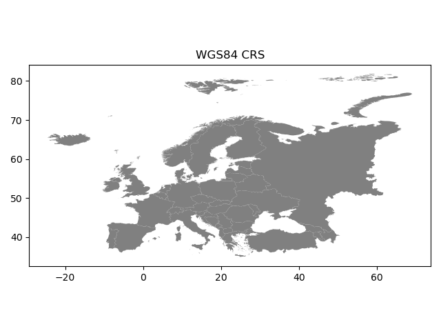
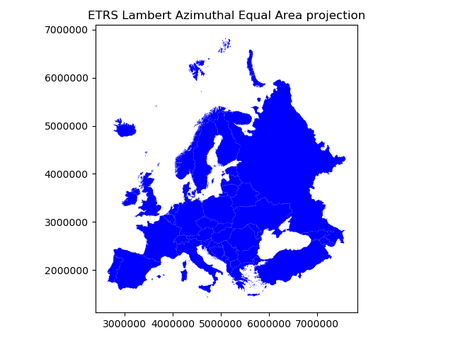
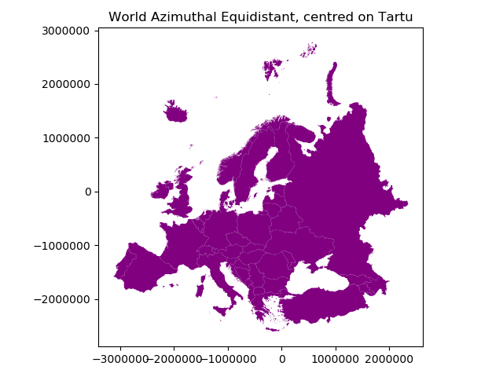

Map projections
===============

Coordinate reference systems (CRS) are important because the geometric shapes in a GeoDataFrame are simply a
collection of coordinates in an arbitrary space. A CRS tells Python how those coordinates related to places on
the Earth. A map projection (or a projected coordinate system) is a systematic transformation of the latitudes and
longitudes into a plain surface where units are quite commonly represented as meters (instead of decimal degrees).

As map projections of gis-layers are fairly often defined differently (i.e. they do not match), it is a
common procedure to redefine the map projections to be identical in both
layers. It is important that the layers have the same projection as it
makes it possible to analyze the spatial relationships between layers,
such as in conducting the Point in Polygon spatial query.

Coordinate Reference Systems (CRS)
----------------------------------

Coordinate Reference Systems (CRS), also referred to as Spatial Reference Systems (SRS), include two common types:

- Geographic Coordinate Sytems
- Projected Coordinate Systems

.. admonition:: Attention

    In developer jargon and often also sloppily used by GIS technicians, the term "projection" is often used for all types of CRS/SRS. For example, WGS84 is called WGS84 projection.
    To be correct, WGS84, is a Geographic Coordinate System and **NOT** a projection.

Geographic coordinate system (GCS)
~~~~~~~~~~~~~~~~~~~~~~~~~~~~~~~~~~

A geographic coordinate system uses a ellipsoidal surface to define locations on the Earth.
There are three parts to a geographic coordinate system:

- A datum - an ellipsoidal (spheroid) model of the Earth to use. Common datums include WGS84 (used in GPS).
- A prime meridian
- Angular unit of measure

Both latitude and longitude are typically represented in two ways:

- Degrees, Minutes, Seconds (DMS), for example, 58° 23′ 12′ ′N, 26° 43′ 21′ ′E
- Decimal Degrees (DD) used by computers and stored as float data type, for example, 58.38667 and 26.7225

Projected coordinate system (PCS)
~~~~~~~~~~~~~~~~~~~~~~~~~~~~~~~~~

Projected coordinate systems define a flat 2D Cartesian surface. Unlike a geographic coordinate system,
a projected coordinate system has constant lengths, angles, and areas across the two dimensions.
A projected coordinate system is always based on a geographic coordinate system that references a specific datum.

Projected Coordinate Systems consist of:

- Geographic Coordinate System
- Projection Method
- Projection Parameters (standard points and lines, Latitude of Origin, Longitude of Origin, False Easting, False Northing etc)
- Linear units (meters, kilometers, miles etc)

Defining and changing CRSs in Geopandas
~~~~~~~~~~~~~~~~~~~~~~~~~~~~~~~~~~~~~~~

Luckily, defining and changing CRSs is easy in Geopandas. In this tutorial we will see how to retrieve the
coordinate reference system information from the data, and how to change it. We will re-project a data file from
WGS84 (lat, lon coordinates) into a Lambert Azimuthal Equal Area projection which is the `recommended projection for
Europe <http://mapref.org/LinkedDocuments/MapProjectionsForEurope-EUR-20120.pdf>`_ by European Commission.

.. note::

   Choosing an appropriate projection for your map is not always straightforward because it depends on what you actually want
   to represent with your map, and what is the spatial scale of your data. In fact, there does not exist a "perfect projection"
   since each one of them has some strengths and weaknesses, and you should choose such projection that fits best for your needs.
   You can read more about `how to choose a map projection from here <http://www.georeference.org/doc/guide_to_selecting_map_projections.htm>`_,
   and a nice `blog post about the strengths and weaknesses of few commonly used projections <http://usersguidetotheuniverse.com/index.php/2011/03/03/whats-the-best-map-projection/>`_.

Download data
-------------

For this tutorial we will be using a Shapefile representing Europe. Download and extract `Europe_borders.zip <../_static/data/L2/Europe_borders.zip>`_ file
that contains a Shapefile with following files:

.. code::

    Europe_borders.cpg  Europe_borders.prj  Europe_borders.sbx  Europe_borders.shx
    Europe_borders.dbf  Europe_borders.sbn  Europe_borders.shp

Changing Coordinate Reference System
------------------------------------

GeoDataFrame that is read from a Shapefile contains *always* (well not
always but should) information about the coordinate system in which the
data is projected.

Let's start by reading the data from the ``Europe_borders.shp`` file.

.. ipython:: python

    import geopandas as gpd

    # Filepath to the Europe borders Shapefile
    fp = "source/_static/data/L2/Europe_borders.shp"

    # Read data
    data = gpd.read_file(fp)

We can see the current coordinate reference system from ``.crs``
attribute:

.. ipython:: python

    data.crs

So from this disctionary we can see that the data is something called
**epsg:4326**. The EPSG number (*"European Petroleum Survey Group"*) is
a code that tells about the coordinate system of the dataset. "`EPSG
Geodetic Parameter Dataset <http://www.epsg.org/>`_ is a collection of
definitions of coordinate reference systems and coordinate
transformations which may be global, regional, national or local in
application". EPSG-number 4326 that we have here belongs to the WGS84
coordinate system (i.e. coordinates are in decimal degrees (lat, lon)).

You can find a lot of information about different available coordinate reference systems from:

  - `www.spatialreference.org <http://spatialreference.org/>`_
  - `www.epsg.io <https://epsg.io/>`_
  - `www.proj4.org <http://proj4.org/projections/index.html>`_
  - `www.mapref.org <http://mapref.org/CollectionofCRSinEurope.html>`_

Let's also check the values in our ``geometry`` column.

.. ipython:: python

    data['geometry'].head()

So the coordinate values of the Polygons indeed look like lat-lon values.

Let's convert those geometries into Lambert Azimuthal Equal Area projection (`EPSG: 3035 <http://spatialreference.org/ref/epsg/etrs89-etrs-laea/>`_).
Changing the CRS is really easy to `do in Geopandas <http://geopandas.org/projections.html#re-projecting>`_
with ``.to_crs()`` -function. As an input for the function, you
should define the column containing the geometries, i.e. ``geometry``
in this case, and a ``epgs`` value of the CRS that you want to use.

.. ipython:: python

    # Let's take a copy of our layer
    data_proj = data.copy()
    
    # Reproject the geometries by replacing the values with projected ones
    data_proj = data_proj.to_crs(epsg=3035)

Let's see how the coordinates look now.

.. ipython:: python

    data_proj['geometry'].head()

And here we go, the numbers have changed! Now we have successfully
changed the CRS of our layer into a new one, i.e. to ETRS-LAEA projection.

.. note::

   There is also possibility to pass the CRS information as proj4 strings or dictionaries,
   see more `here <http://geopandas.org/projections.html#coordinate-reference-systems>`_

To really understand what is going on, it is good to explore our data visually. Hence, let's compare the datasets by making
maps out of them.

.. code:: python

    import matplotlib.pyplot as plt

    # Plot the WGS84
    data.plot(facecolor='gray');

    # Add title
    plt.title("WGS84 CRS");

    # Remove empty white space around the plot
    plt.tight_layout()
    
    # Plot the one with ETRS-LAEA projection
    data_proj.plot(facecolor='blue');

    # Add title
    plt.title("ETRS Lambert Azimuthal Equal Area projection");

    # Remove empty white space around the plot
    plt.tight_layout()

.. ipython:: python
   :suppress:

       import matplotlib.pyplot as plt;
       data.plot(facecolor='gray');
       plt.title("WGS84 CRS");
       @savefig wgs84.png width=3.5in
       plt.tight_layout();

       data_proj.plot(facecolor="blue");
       plt.title("ETRS Lambert Azimuthal Equal Area projection");
       @savefig projected.png width=3.5in
       plt.tight_layout();

Indeed, they look quite different and our re-projected one looks much better
in Europe as the areas especially in the north are more realistic and not so stretched as in WGS84.

Finally, let's save our projected layer into a Shapefile so that we can use it later.

.. code:: python

    # Ouput file path
    out_fp = "Europe_borders_epsg3035.shp"
    
    # Save to disk
    data_proj.to_file(out_fp)

.. note::

   On Windows, the prj -file might NOT update with the new CRS value when using the ``from_epsg()`` -function. If this happens
   it is possible to fix the prj by passing the coordinate reference information as proj4 text for EPSG:3035, like following.

   .. ipython:: python

      data_proj.crs = '+proj=laea +lat_0=52 +lon_0=10 +x_0=4321000 +y_0=3210000 +ellps=GRS80 +units=m +no_defs'

   You can find ``proj4`` text versions for different CRS from `spatialreference.org <http://spatialreference.org>`_.
   Each page showing spatial reference information has links for different formats for the CRS. Click a link that says ``Proj4`` and
   you will get the correct proj4 text presentation for your CRS.

Calculating distances
---------------------

Let's, continue working with our ``Europe_borders.shp`` file and find out the Euclidean distances from
the centroids of the European countries to Tartu, Estonia. We will calculate the distance between Tartu and
other European countries (centroids) using a metric projection (World Azimuthal Equidistant) that gives us the distance
in meters.

- Let's first import necessary packages.

.. ipython:: python

    from shapely.geometry import Point
    from fiona.crs import from_epsg

Next we need to specify our CRS to metric system using `World Azimuthal Equidistant -projection <https://epsg.io/54032>`_ where distances are represented correctly from the center longitude and latitude.

- Let's specify our target location to be the coordinates of Tartu (lon=26.7290 and lat=58.3780).

.. ipython:: python
    
    tartu_lon = 26.7290
    tartu_lat = 58.3780

Next we need to specify a Proj4 string to reproject our data into World Azimuthal Equidistant
in which we also want to center our projection to Tartu. We need to specify the ``+lat_0`` and ``+lon_0`` parameters in Proj4 string to do this.

.. ipython:: python

   proj4_txt = '+proj=aeqd +lat_0=58.3780 +lon_0=26.7290 +x_0=0 +y_0=0 +ellps=WGS84 +datum=WGS84 +units=m +no_defs'

Now we are ready to transform our ``Europe_borders.shp`` data into the desired projection. Let's create a new
copy of our GeoDataFrame called ``data_d`` (d for 'distance').

.. ipython:: python

   data_d = data.to_crs(proj4_txt)

Let's take a look of our data and create a map, so we can see what we have now.

.. ipython:: python

   data_d.plot(facecolor='purple');
   plt.title("World Azimuthal Equidistant, centred on Tartu");
   @savefig europe_euqdist.png width=4.5in
   plt.tight_layout();

From here we can see that indeed our map is now centered to Tartu as the 0-position in both x and y is on top of Tartu.

- Let's continue our analysis by creating a Point object from Tartu and insert it into a GeoPandas GeoSeries. We also specify that the CRS of the GeoSeries is WGS84. You can do this by using ``crs`` parameter when creating the GeoSeries.

.. ipython:: python

   tartu = gpd.GeoSeries([Point(tartu_lon, tartu_lat)], crs=from_epsg(4326))

- Let's convert this point to the same CRS as our Europe data is.

.. ipython:: python

   tartu = tartu.to_crs(proj4_txt)
   print(tartu)

Aha! So the Point coordinates of Tartu are 0. This confirms us that the center point of our projection is indeed Tartu.

Next we need to calculate the centroids for all the Polygons of the European countries. This can be done easily in Geopandas by using the ``centroid`` attribute.

.. ipython:: python

   data_d['country_centroid'] = data_d.centroid
   data_d.head(2)

So now we have a new column ``country_centroid`` that has the Point geometries representing the centroids of each Polygon.

Now we can calculate the distances between the centroids and Tartu.
We saw an example in an erarlier lesson/exercise where we used ``apply()`` function for doing the loop instead of using the ``iterrows()`` function.

In (Geo)Pandas, the ``apply()`` function takes advantage of numpy when looping, and is hence much faster
which can give a lot of speed benefit when you have many rows to iterate over. Here, we will see how we can use that
to calculate the distance between the centroids and Tartu. We will create our own function to do this calculation.

 - Let's first create our function called ``calculateDistance()``.

.. code:: python

   def calculateDistance(row, dest_geom, src_col='geometry', target_col='distance'):
       """
       Calculates the distance between a single Shapely Point geometry and a GeoDataFrame with Point geometries.

       Parameters
       ----------
       dest_geom : shapely.Point
           A single Shapely Point geometry to which the distances will be calculated to.
       src_col : str
           A name of the column that has the Shapely Point objects from where the distances will be calculated from.
       target_col : str
           A name of the target column where the result will be stored.
       """
       # Calculate the distances
       dist = row[src_col].distance(dest_geom)
       # Tranform into kilometers
       dist_km = dist/1000
       # Assign the distance to the original data
       row[target_col] = dist_km
       return row

.. ipython:: python
   :suppress:

      def calculateDistance(row, dest_geom, src_col='geometry', target_col='distance'):
          dist = row[src_col].distance(dest_geom)
          dist_km = dist/1000
          row[target_col] = dist_km
          return row

The parameter row is used to pass the data from each row of our GeoDataFrame into our function and then the other paramaters are used for passing other necessary information for using our function.

- Before using our function and calculating the distances between Tartu and centroids, we need to get the Shapely point geometry from the re-projected Tartu center point. We can use the ``get()`` function to retrieve a value from specific index (here index 0).

.. ipython:: python

   tartu_geom = tartu.get(0)
   print(tartu_geom)

Now we are ready to use our function with ``apply()`` function. When using the function, it is important to specify that the ``axis=1``.
This specifies that the calculations should be done row by row (instead of column-wise).

.. ipython:: python

   data_d = data_d.apply(calculateDistance, dest_geom=tartu_geom, src_col='country_centroid', target_col='dist_to_tartu', axis=1)
   data_d.head(20)

Great! Now we have successfully calculated the distances between the Polygon centroids and Tartu. :)

Let's check what is the longest and mean distance to Tartu from the centroids of other European countries.

.. ipython:: python

   max_dist = data_d['dist_to_tartu'].max()
   mean_dist = data_d['dist_to_tartu'].mean()
   print("Maximum distance to Tartu is {:.2f} km, and the mean distance is {:.2f} km.".format(max_dist, mean_dist))

.. note::

   If you would like to calculate distances between multiple locations across the globe, it is recommended to use
   `Haversine formula <https://en.wikipedia.org/wiki/Haversine_formula>`_ to do the calculations.
   `Haversine <https://github.com/mapado/haversine>`_ package in Python provides an easy-to-use function for calculating these
   based on latitude and longitude values.
