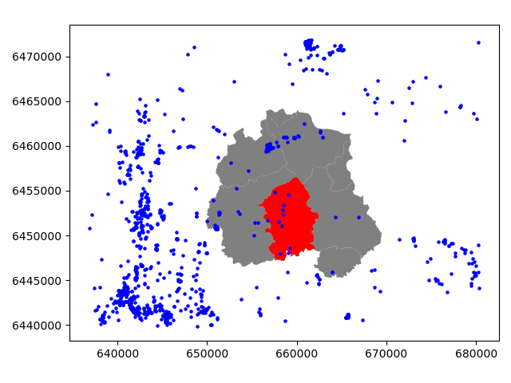

Point in Polygon & Intersect
============================

Finding out if a certain point is located inside or outside of an area,
or finding out if a line intersects with another line or polygon are
fundamental geospatial operations that are often used e.g. to select
data based on location. Such spatial queries are one of the typical
first steps of the workflow when doing spatial analysis. Performing a
spatial join (will be introduced later) between two spatial datasets is
one of the most typical applications where Point in Polygon query
is used.

How to check if point is inside a polygon?
------------------------------------------

Computationally, detecting if a point is inside a polygon is a complicated matter.
Luckily, we can use ready-made function for
conducting the Point in Polygon query. We can take
advantage of `Shapely's binary
predicates <https://shapely.readthedocs.io/en/latest/manual.html#binary-predicates>`_
that can evaluate the topolocical relationships between geographical
objects, such as the PIP as we're interested here.

There are basically two ways of conducting Point in Polygon queries in Shapely:

1. using a function called
   `.within() <https://shapely.readthedocs.io/en/latest/manual.html#object.within>`_
   that checks if a point is within a polygon
2. using a function called
   `.contains() <https://shapely.readthedocs.io/en/latest/manual.html#object.contains>`_
   that checks if a polygon contains a point

Notice: even though we are talking here about **Point** in Polygon
operation, it is also possible to check if a LineString or Polygon is
inside another Polygon.

-  Let's first create a Polygon using a list of coordinate-tuples and a
   couple of Point objects

.. ipython:: python
   :suppress:

    import gdal
    from shapely.geometry import Point, Polygon
    p1 = Point(24.952242, 60.1696017)
    p2 = Point(24.976567, 60.1612500)
    coords = [(24.950899, 60.169158), (24.953492, 60.169158), (24.953510, 60.170104), (24.950958, 60.169990)]
    poly = Polygon(coords)

.. code:: python

    from shapely.geometry import Point, Polygon

    # Create Point objects
    p1 = Point(24.952242, 60.1696017)
    p2 = Point(24.976567, 60.1612500)

    # Create a Polygon
    coords = [(24.950899, 60.169158), (24.953492, 60.169158), (24.953510, 60.170104), (24.950958, 60.169990)]
    poly = Polygon(coords)

.. ipython:: python

    # Let's check what we have
    print(p1)
    print(p2)
    print(poly)

-  Let's check if those points are ``within`` the polygon

.. ipython:: python

    # Check if p1 is within the polygon using the within function
    p1.within(poly)
    
    # Check if p2 is within the polygon
    p2.within(poly)

Okey, so we can see that the first point seems to be inside that polygon
and the other one doesn't.

-  In fact, the first point is close to the center of the polygon as we
   can see:

.. ipython:: python

    # Our point
    print(p1)

    # The centroid
    print(poly.centroid)

-  It is also possible to do PIP other way around, i.e. to check if
   polygon contains a point:

.. ipython:: python

    # Does polygon contain p1?
    poly.contains(p1)

    # Does polygon contain p2?
    poly.contains(p2)

Thus, both ways of checking the spatial relationship results in the same way.

Which one should you use then? Well, it depends:

- if you have many points and just one polygon and you try to find out which one of them is inside the polygon:
- you need to iterate over the points and check one at a time if it is **within()** the polygon specified

- if you have many polygons and just one point and you want to find out which polygon contains the point
- you need to iterate over the polygons until you find a polygon that **contains()** the point specified (assuming there are no overlapping polygons)

Intersect
---------

Another typical geospatial operation is to see if a geometry
`intersect <https://shapely.readthedocs.io/en/latest/manual.html#object.intersects>`_
or `touches <https://shapely.readthedocs.io/en/latest/manual.html#object.touches>`_
another one. The difference between these two is that:

-  if objects intersect, the boundary and interior of an object needs to
   intersect in any way with those of the other.

-  If an object touches the other one, it is only necessary to have (at
   least) a single point of their boundaries in common but their
   interiors shoud NOT intersect.

Let's try these out.

-  Let's create two LineStrings

.. ipython:: python
   :suppress:

    # THIS CODE WILL NOT BE SHOWN, THE ONE BELOW IS!
    from shapely.geometry import LineString, MultiLineString
    line_a = LineString([(0, 0), (1, 1)])
    line_b = LineString([(1, 1), (0, 2)])

.. code:: python

    from shapely.geometry import LineString, MultiLineString

    # Create two lines
    line_a = LineString([(0, 0), (1, 1)])
    line_b = LineString([(1, 1), (0, 2)])

-  Let's see if they intersect

.. ipython:: python

    line_a.intersects(line_b)

-  Do they also touch each other?

.. ipython:: python

    line_a.touches(line_b)

Indeed, they do and we can see this by plotting the features together

.. ipython:: python

    # Create a MultiLineString
    multi_line = MultiLineString([line_a, line_b])
    multi_line

Thus, the ``line_b`` continues from the same node ( (1,1) ) where ``line_a`` ends.

However, if the lines overlap fully, they don't touch due to the spatial relationship rule, as we can see:

- Check if line_a touches itself

.. ipython:: python

    # Does the line touch with itself?
    line_a.touches(line_a)

- It does not. However, it does intersect

.. ipython:: python

    # Does the line intersect with itself?
    line_a.intersects(line_a)

Point in Polygon using Geopandas
--------------------------------

Next we will do a practical example where we check which of Estonian Category III protected species
sightings from a prepared monitoring GeoPackage file, `category_3_species_porijogi.gpkg <../_static/data/L3/category_3_species_porijogi.gpkg>`_, are located in
the Idaoja sub-catchment of the Porijogi river, by cross-checking with the polygons from `a GeoJSON-file <../_static/data/L3/porijogi_sub_catchments.geojson>`_ .
The Polygons are the modelled sub-catchments of the Porijogi river.

However, reading a layer from a GeoPackage file needs an additional information of the ``layer`` name, because GeoPackage is basically an embedded database format,
building on top of SQLite.

- Let's start by reading the addresses from the GeoPackage layer file.

.. ipython:: python

   import geopandas as gpd
   # protected species under class 3 monitoring sightings
   species_fp = "source/_static/data/L3/category_3_species_porijogi.gpkg"
   species_data = gpd.read_file(species_fp, layer='category_3_species_porijogi', driver='GPKG')

Reading GeoJSON-files in Geopandas
~~~~~~~~~~~~~~~~~~~~~~~~~~~~~~~~~~

It is possible to read the data from GeoJSON-file in the same manner as Shapefile.

.. ipython:: python

   # porijogi_sub_catchments
   polys_fp = "source/_static/data/L3/porijogi_sub_catchments.geojson"
   polys = gpd.read_file(polys_fp, driver='GeoJSON')
   polys.head(5)

Nice, now we can see that we have the sub-diveded catchments for the Porijogi river. We are interested in the sub-catchment that is called ``Idaoja``.

- Let's select that one and see where it is located, and plot also the points on top of the map.

.. code:: python

   import matplotlib.pyplot as plt
   %matplotlib inline
   plt.style.use('ggplot')
   plt.rcParams['figure.figsize'] = (15, 15)

.. ipython:: python

   @suppress
   import matplotlib.pyplot as plt

   subcatch = polys.loc[polys['NAME_1']=='Idaoja']
   subcatch.reset_index(drop=True, inplace=True)
   fig, ax = plt.subplots();
   polys.plot(ax=ax, facecolor='gray');
   subcatch.plot(ax=ax, facecolor='red');
   species_data.plot(ax=ax, color='blue', markersize=5);
   @savefig species_catchment.png width=7in
   plt.tight_layout();

Okey, so we can see that, indeed, certain points are within the selected red Polygon.

Let's find out which one of them are located within the Polygon. Hence, we are conducting a Point in Polygon query.

- Let's first enable shapely.speedups which makes some of the spatial queries running faster.

.. ipython:: python

   import shapely.speedups
   shapely.speedups.enable()

- Let's check which Points are within the ``subcatch`` Polygon. Notice, that here we check if the Points are ``within`` the **geometry**
  of the ``subcatch`` GeoDataFrame. Hence, we use the ``loc[0, 'geometry']`` to parse the actual Polygon geometry object from the GeoDataFrame.

.. ipython:: python

   pip_mask = species_data.within(subcatch.loc[0, 'geometry'])
   display(pip_mask)

As we can see, we now have an array of boolean values for each row, where the result is ``True``
if Point was inside the Polygon, and ``False`` if it was not.

- We can now use this mask array to select the Points that are inside the Polygon. Selecting data with this kind of mask array (of boolean values) is
  easy by passing the array inside the ``loc`` indexing function of Pandas.

.. ipython:: python

   pip_data = species_data.loc[pip_mask]
   pip_data

Let's finally confirm that our Point in Polygon query worked as it should by plotting the data.

.. ipython:: python

   subcatch = polys.loc[polys['NAME_1']=='Idaoja']
   subcatch.reset_index(drop=True, inplace=True)
   fig, ax = plt.subplots()
   polys.plot(ax=ax, facecolor='gray');
   subcatch.plot(ax=ax, facecolor='red');
   pip_data.plot(ax=ax, color='gold', markersize=10);
   @savefig species_catchment_pip.png width=7in
   plt.tight_layout();

.. image:: ../_static/img/species_catchment_pip.png

Now we only have the (golden) points that, indeed, are inside the red Polygon which is exactly what we wanted!