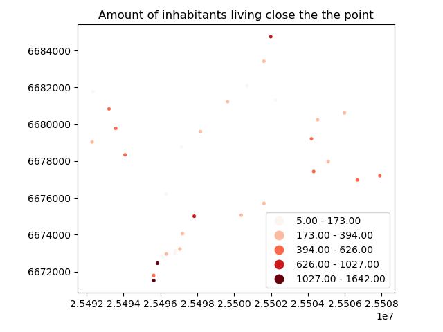

Spatial join
============

`A Spatial join <http://wiki.gis.com/wiki/index.php/Spatial_Join>`_ is
yet another classic GIS problem. Getting attributes from one layer and
transferring them into another layer based on their spatial relationship
is something you most likely need to do on a regular basis.

The previous materials focused on learning how to perform a `Point in Polygon query <point-in-polygon.html>`_.
We could now apply those techniques and create our
own function to perform a spatial join between two layers based on their
spatial relationship. We could for example join the attributes of a
polygon layer into a point layer where each point would get the
attributes of a polygon that ``contains`` the point.

Luckily, `spatial joins <http://geopandas.org/mergingdata.html#spatial-joins>`_
(``gpd.sjoin()`` -function) is already implemented in Geopandas, thus we
do not need to create it ourselves. There are three possible types of
join that can be applied in spatial join that are determined with ``op``
-parameter:

-  ``"intersects"``
-  ``"within"``
-  ``"contains"``

Sounds familiar? Yep, all of those spatial relationships were discussed
in the `previous materials <point-in-polygon.html>`_, thus you should know how they work.

Let's perform a spatial join between the address-point `Shapefile (addresses.shp) <../_static/data/L3/addresses.zip>`_
and a Polygon layer that is a 250m x 250m grid showing the amount of people living in Helsinki Region.

Download and clean the data
~~~~~~~~~~~~~~~~~~~~~~~~~~~

For this lesson we will be using publicly available population data from
Helsinki that can be downloaded from `Helsinki Region Infroshare
(HRI) <http://www.hri.fi/en/dataset/vaestotietoruudukko>`_ .

From HRI **download** the `Population grid for year
2015 <../_static/data/L3/Vaestotietoruudukko_2015.zip>`_
that is a dataset (.shp) produced by Helsinki Region Environmental
Services Authority (HSY) (see `this
page <https://www.hsy.fi/fi/asiantuntijalle/avoindata/Sivut/AvoinData.aspx?dataID=7>`_
to access data from different years).

-  Unzip the file into into your L3 folder

.. code::

    Vaestotietoruudukko_2015.dbf  Vaestotietoruudukko_2015.shp
    Vaestotietoruudukko_2015.prj  Vaestotietoruudukko_2015.shx

You should now have the files listed above in your Data folder.

-  Let's read the data into geopandas and see what we have.

.. ipython:: python

    import geopandas as gpd

    # Filepath
    fp = "source/_static/data/L3/Vaestotietoruudukko_2015.shp"

    # Read the data
    pop = gpd.read_file(fp)

.. ipython:: python

    # See the first rows
    pop.head()

Okey so we have multiple columns in the dataset but the most important
one here is the column ``ASUKKAITA`` (*population in Finnish*) that
tells the amount of inhabitants living under that polygon.

-  Let's change the name of that columns into ``pop15`` so that it is
   more intuitive. Changing column names is easy in Pandas / Geopandas
   using a function called ``rename()`` where we pass a dictionary to a
   parameter ``columns={'oldname': 'newname'}``.

.. ipython:: python

    # Change the name of a column
    pop = pop.rename(columns={'ASUKKAITA': 'pop15'})
    
    # See the column names and confirm that we now have a column called 'pop15'
    pop.columns

-  Let's also get rid of all unnecessary columns by selecting only
   columns that we need i.e. ``pop15`` and ``geometry``

.. ipython:: python

    # Columns that will be sected
    selected_cols = ['pop15', 'geometry']
    
    # Select those columns
    pop = pop[selected_cols]

    # Let's see the last 2 rows
    pop.tail(2)

Now we have cleaned the data and have only those columns that we need
for our analysis.

Join the layers
~~~~~~~~~~~~~~~

Now we are ready to perform the spatial join between the two layers that
we have. The aim here is to get information about **how many people live
in a polygon that contains an individual address-point** . Thus, we want
to join attributes from the population layer we just modified into the
addresses point layer ``addresses_epsg3879.shp``.

-  Read the addresses layer into memory

.. ipython:: python

    # Addresses file path
    addr_fp = "source/_static/data/L3/addresses.shp"
    
    # Read data
    addresses = gpd.read_file(addr_fp)

    # Check the crs of population layer, it's not immediately visiable, but it is EPSG 3879
    pop.crs

    # So we need to reproject the geometries to make them comparable
    addresses = addresses.to_crs(pop.crs)

    # Check the head of the file
    addresses.head(2)

-  Let's make sure that the coordinate reference system of the layers
   are identical

.. ipython:: python

    # Check the crs of address points
    addresses.crs
    
    # Check the crs of population layer
    pop.crs
    
    # Do they match? - We can test that
    addresses.crs == pop.crs

They are identical. Thus, we can be sure that when doing spatial
queries between layers the locations match and we get the right results
e.g. from the spatial join that we are conducting here.

-  Let's now join the attributes from ``pop`` GeoDataFrame into
   ``addresses`` GeoDataFrame by using ``gpd.sjoin()`` -function

.. ipython:: python

    # Make a spatial join
    join = gpd.sjoin(addresses, pop, how="inner", op="within")
    
    # Let's check the result
    join.head()

Awesome! Now we have performed a successful spatial join where we got
two new columns into our ``join`` GeoDataFrame, i.e. ``index_right``
that tells the index of the matching polygon in the ``pop`` layer and
``pop15`` which is the population in the cell where the address-point is
located.

-  Let's save this layer into a new Shapefile

.. code:: python

    # Output path
    outfp = "source/_static/data/L3/addresses_pop15_projected.shp"
    
    # Save to disk
    join.to_file(outfp)

Do the results make sense? Let's evaluate this a bit by plotting the
points where color intensity indicates the population numbers.

-  Plot the points and use the ``pop15`` column to indicate the color.
   ``cmap`` -parameter tells to use a sequential colormap for the
   values, ``markersize`` adjusts the size of a point, ``scheme`` parameter can be used to adjust the classification method based on `pysal <http://pysal.readthedocs.io/en/latest/library/esda/mapclassify.html>`_, and ``legend`` tells that we want to have a legend.

.. ipython:: python
   :okwarning:

    import matplotlib.pyplot as plt

    # Plot the points with population info
    join.plot(column='pop15', cmap="Reds", markersize=7, scheme='fisher_jenks', legend=True);

    # Add title
    plt.title("Amount of inhabitants living close the the point");

    # Remove white space around the figure
    @savefig population_points.png width=7in
    plt.tight_layout();

By knowing approximately how population is distributed in Helsinki, it
seems that the results do make sense as the points with highest
population are located in the south where the city center of Helsinki
is.
