Working with Raster data
========================

Data Structures Recap: Raster and Vector
----------------------------------------

The two primary types of geospatial data are raster and vector data:  

* Vector data structures represent specific features on the Earth's surface, and assign attributes to those features.  
* Raster data is stored as a grid of values which are rendered on a map as pixels. Each pixel value represents an area on the Earth's surface. 

Raster data is any pixelated (or gridded) data where each pixel is associated with a specific geographical location. The value of a pixel can be continuous (e.g. elevation) or categorical (e.g. land use).
If this sounds familiar, it is because this data structure is very common: it’s how we represent any digital image.
A geospatial raster is only different from a digital photo in that it is accompanied by spatial information that connects the data to a particular location.
This includes the raster’s extent and cell size, the number of rows and columns, and its coordinate reference system (or CRS).

.. image:: ../_static/img/raster_concept.png
    :width: 500

*Source: National Ecological Observatory Network (NEON)*

Common properties of any raster:

* number of rows and columns (sometimes referred to as lines and samples)
* data type (dtype, or bit depth) - e.g., 8-bit (2^8 possible values, 0-255) 
* some kind of resolution information, often dots per inch (dpi) with raster graphics

A geospatial raster is only different from a digital photo in that it is accompanied by metadata that connects the grid to a particular location.

Examples of continuous rasters
~~~~~~~~~~~~~~~~~~~~~~~~~~~~~~

2. Digital Elevation Models (DEMs) such as `ASTER GDEM <https://asterweb.jpl.nasa.gov/gdem.asp>`_
1. Satellite imagery such as those acquired by `Landsat <https://landsat.usgs.gov>`_ or `MODIS <https://modis.gsfc.nasa.gov>`_
3. Maps of canopy height derived from LiDAR data.

A map of elevation for Harvard Forest derived from the `NEON AOP LiDAR sensor <http://www.neonscience.org/data-collection/airborne-remote-sensing>`_
is below. Elevation is represented as continuous numeric variable in this map. The legend
shows the continuous range of values in the data from around 300 to 420 meters.

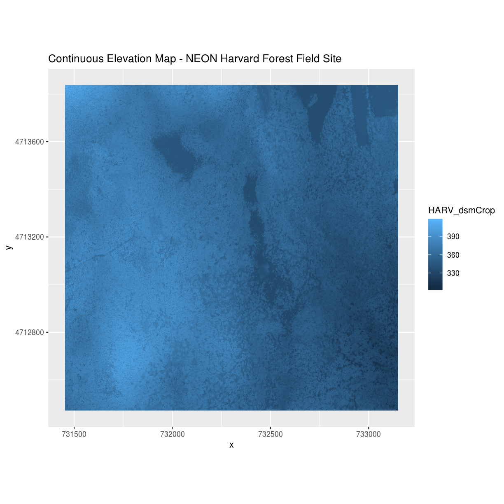

Examples of categorical rasters
~~~~~~~~~~~~~~~~~~~~~~~~~~~~~~~

Some rasters contain categorical data where each pixel represents a discrete class such as a landcover type (e.g., "coniferous forest" or "grassland") rather than a continuous value such as elevation or temperature. Some examples of classified
maps include:

1. Landcover / land-use maps
2. Snowcover masks (binary snow or no snow)

The following map shows elevation data for the NEON Harvard Forest field site. In this map, the elevation data (a continuous variable) has been divided up into categories to yield a categorical raster. 

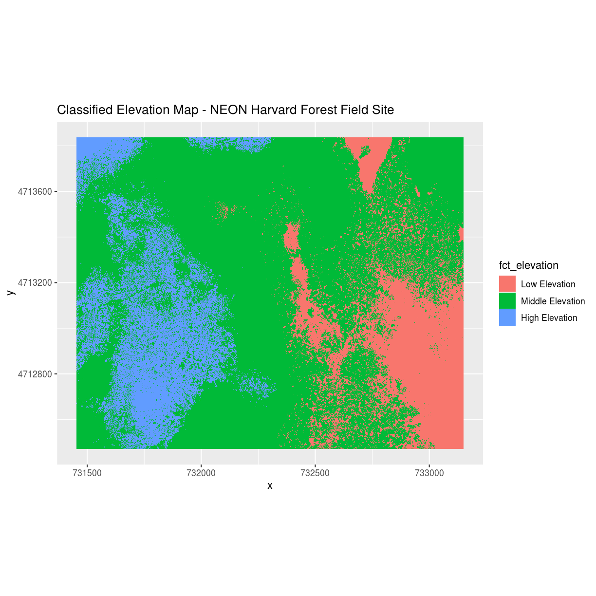

Raster Advantages and Disadvantages
~~~~~~~~~~~~~~~~~~~~~~~~~~~~~~~~~~~

Advantages:

- efficient representation of continuous surfaces
- cell-by-cell calculations can be very fast and efficient
- potentially very high levels of detail
- data is 'unweighted' across its extent

Disadvantages:

- very large file sizes as cell size gets smaller
- can be difficult to represent complex information
- Measurements are spatially arranged in a regular grid, which may not be an accurate representation of real-world phenomena
- Space-filling model assumes that all pixels have value
- Changes in resolution can drastically change the meaning of values in a dataset

What makes a raster geospatial?
~~~~~~~~~~~~~~~~~~~~~~~~~~~~~~~

A raster is just an image in local pixel coordinates until we specify what part of the earth the image covers.  This is done through two fundamental pieces of metadata that accompany the pixel values of the image:

1. Coordinate Reference System or "CRS"

This specifies the datum, projection, and additional parameters needed to place the raster in geographic space, see `lesson 2 crs and projections <../L2/crs-projections.html>`_.

.. image:: ../_static/img/us_crs.jpg
    :width: 500

2. Geotransformation

This is the essential matrix that relates the raster pixel coordinates (rows, columns) to the geographic coordiantes (x and y defined by the CRS).
This is typically a 6-parameter transformation that defines the origin, pixel size and rotation of the raster in the geographic coordinate system:

.. code::

    Xgeo = GT(0) + Xpixel*GT(1) + Yline*GT(2)
    Ygeo = GT(3) + Xpixel*GT(4) + Yline*GT(5)

Defining this for the whole image allows the image's pixels to be referenced by a local array index rather than global coordinates, and answers questions such as:

* How much area does a given pixel cover?
* Given the CRS, what is the origin?
* In what direction does the raster "grow" as pixel indices increase?

3. Extent / BBOX

The affine transformation specifies an "extent" or "bounding box", which is defined by the minimum and maximum x and y coordinates of the data.

4. Resolution / Posting

The affine transformation specifies a pixel size of the area on the ground that each pixel of the raster covers.
This is often refered to as "resolution", but because images are often resampled to different resolutions it is also refered to as "posting" or "ground sample distance (gsd)".
Ultimately, "resolution" refers to a sensors ability to distinguish different objects on the ground. The image below illustrates the effect of changes in resolution: 

.. image:: ../_static/img/raster_resolution.png
    :width: 500

*Source: National Ecological Observatory Network (NEON)*

More resources:

* https://gdal.org/user/raster_data_model.html  
* https://rasterio.readthedocs.io/en/stable/

Multi-band Raster Data
~~~~~~~~~~~~~~~~~~~~~~

A raster can contain one or more bands. In a multi-band dataset, the rasters will always have the same extent,
resolution, and CRS. Each band represents light reflected (or emmitted) from the different portions of the electromagnetic spectrum. The pixel brightness for each band, when composited creates the colors that we see in an image.

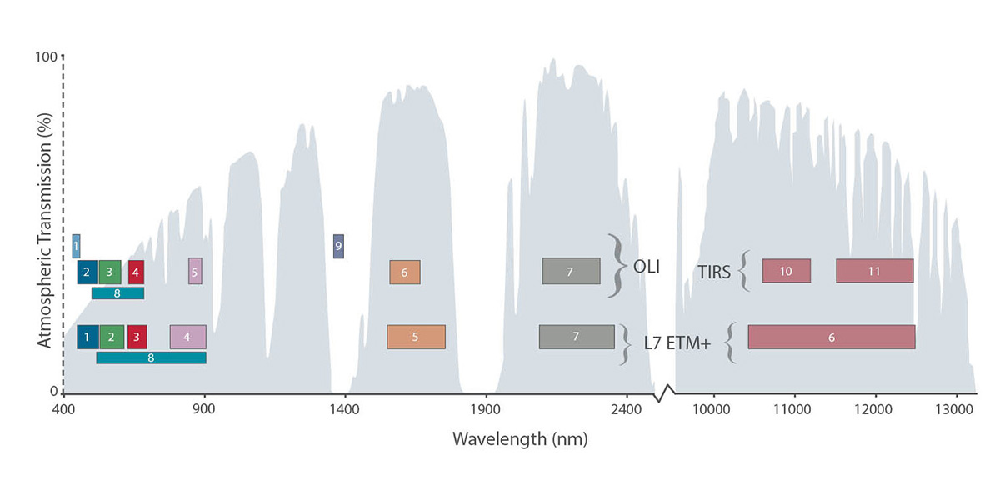

*Source: L.Rocchio & J.Barsi*

One type of multi-band raster dataset that is familiar to many of us is a color image. A basic color image consists of three bands: red, green, and blue.

.. image:: ../_static/img/RGBSTack_1.jpg
    :width: 500

*Source: National Ecological Observatory Network (NEON).*

    
Multi-band raster data might also contain:

1. Time series: the same variable, over the same area, over time
2. Multi or hyperspectral imagery: image rasters that have 4 or more (multi-spectral) or more than 10-15 (hyperspectral) bands

.. admonition:: Key points

    * Raster data is pixelated data stored as a matrix
    * Raster images are often packaged as multidimensional arrays - containing for example RGB and other spectral bands
    * Geospatial raster data always has a coordinate reference system (CRS) and geotransform that maps image coordinates to locations on Earth's surface
    * People often refer to "resolution" as the ground pixel size of a raster, but more specifically it refers to the sensor's ability to disabiguate adjacent objects on the ground

Exploring and visualisation of raster data
------------------------------------------

`Rasterio <https://rasterio.readthedocs.io/en/stable/>`_ is a very useful module for raster processing which you can use for reading and writing several different raster formats in Python.
Rasterio is based on GDAL and Python automatically registers all known GDAL drivers for reading supported formats when importing the module.
Most common file formats include for example TIFF and GeoTIFF, ASCII Grid and Erdas Imagine .img -files.

Download `example tif raster file forest_loss_porijogi_wgs84.tif <../_static/data/L4/forest_loss_porijogi_wgs84.tif>`_

This is a categorical raster containing one band, which is representing the measured (by satellite) forest loss of the years 2001-2018.
Each raster cell should have a value, from 0 to 18, representing 0: no forest loss, or one of the numbers 1-18, indicating forest less in this cell in the year 20xx.

Let's open the dataset:

.. ipython:: python

    import rasterio
    dataset = rasterio.open('source/_static/data/L4/forest_loss_porijogi_wgs84.tif')

The ``dataset`` handle in rasterio provides many useful informative attributes:

.. ipython:: python

    print(dataset.name)
    print(dataset.mode)
    print(dataset.count)
    print(dataset.width)
    print(dataset.height)
    print(dataset.crs)
    print(dataset.bounds)

Another interesting, slightly more complex, attribute is the profile. Where we can quickly see a variety of important aspects.

.. ipython:: python
    
    print(dataset.profile)

As explained above in the introduction, this is the Geotransformation / Geotransform:

.. ipython:: python

    print(dataset.transform)

    for i in range(len(dataset.indexes) ):
        print("{}: {}".format(i, dataset.dtypes[i]))

Each raster dataset can have several so called bands. Each band in Python and Rasterio is essentially handled as a Numpy array, ``ndarray``. The same computationally efficient data structure that also underlies our Pandas dataframes.

.. ipython:: python

    # reading the first band (not from zero!)
    band1 = dataset.read(1)
    band1

And similarly to other plotting mechanisms, like we use for Pandas or Geopandas, we use ``matplotlib`` for the foundational functionality.
Now, as we learned, raster datasets are essentially "just" pixels in a properly organized grid - an image - we can use default plotting from matplotlib and numpy to plot a basic 2D image.

.. ipython:: python
    :okwarning:

    import matplotlib.pyplot as plt
    # add this in your Jupyter Notebook too
    # %matplotlib inline
    
    plt.imshow(band1)
    @savefig forest-loss-year1.png width=7in
    plt.tight_layout()

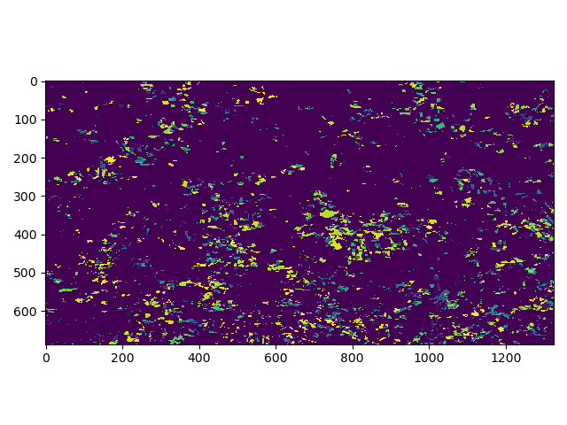

For convenience, Rasterio provides its own slightly advancd plot method, called ``show()``, where we can either add the whole dataset or specific bands.
In order to retain the geotransform logic when plotting a rasterio image, it is of advantage to use the ``tuple``-based nomenclature:

.. ipython:: python
    :okwarning:

    from rasterio.plot import show
    # band1 is just a numpy ndarray
    # show(band1)
    # a tuple -> (dataset, 1) indicating the first band in the raster dataset
    # show((dataset, 1))
    # the whole dataset, eg. RGB bands making up the normal colorspctrum
    show(dataset)
    @savefig forest-loss-year2.png width=7in
    plt.tight_layout()

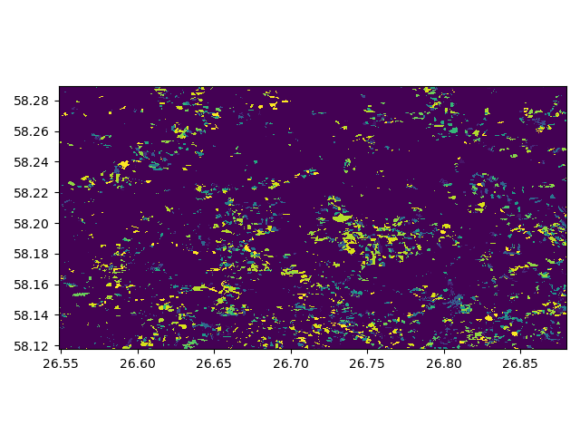

Let's dig deeper into our categorical raster. We use numpy's ``unique`` function to extract all occurring unique values (in our case: the year-based classes). And then we manually calculate the histgram with numpy, too:

.. ipython:: python

    import numpy as np

    # get classes
    uniq_vals = np.unique(band1)

    # display sorted order
    print(sorted(uniq_vals))  

    # Patches = the matplotlib objects drawn
    counts, bins = np.histogram(band1, bins=18)

    # Print histogram outputs
    for i in range(len(bins)-1):
        print("bin lower bound:", bins[i])
        print("counts:", counts[i])

Now, a short side note on adding a custom legend to our plot. Sometimes, we can't get the legend information from the image, so provide it directly.
We use the "viridis" colormap as a base, which is a colorband with 256 colors forming the spectrum of this colormap. We then evenly take color definition elements out of that colormap and assign them to our classes.
The even steps are derived from the number of values in our raster dataset, i.e. in this particular nump ndarray.

.. ipython:: python
    :okwarning:

    from matplotlib.patches import Patch
    from matplotlib.colors import BoundaryNorm
    from matplotlib import rcParams, cycler

    fig, ax = plt.subplots()

    cmap = plt.cm.viridis
    lst = [int(x) for x in np.linspace(0,255,19)]
    legend_patches = [Patch(color=icolor, label=label) for icolor, label in zip( cmap(lst), sorted(uniq_vals))]

    ax.legend(handles=legend_patches, facecolor="white", edgecolor="white", bbox_to_anchor=(1.35, 1))

    plt.imshow(band1, cmap=cmap, interpolation='nearest')
    @savefig forest-loss-year3.png width=7in
    plt.tight_layout()

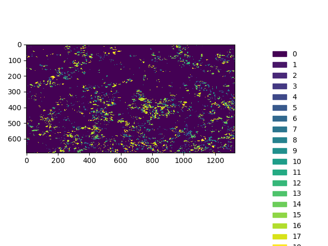

It also always advisable to look at the distribution of values visually, like a histogram plot:

.. ipython:: python
    :okwarning:

    from rasterio.plot import show_hist

    show_hist(dataset, bins=19, lw=0.0, stacked=False, alpha=0.3, histtype='stepfilled', title="Histogram")
    @savefig forest-loss-hist1.png width=7in
    plt.tight_layout()

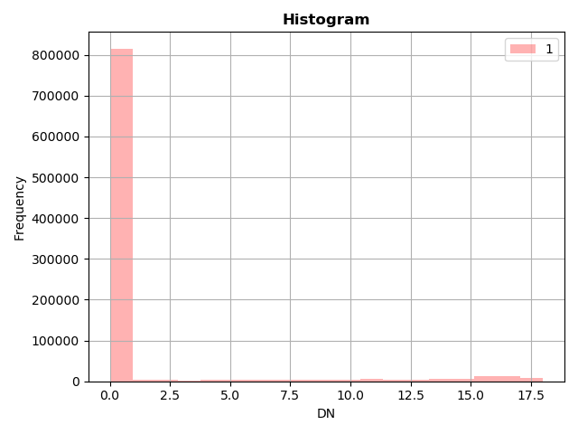

With matplotlib it is also easy to build multi-figure plots:

.. ipython:: python
    :okwarning:

    fig, (ax_dat, ax_hist) = plt.subplots(1, 2, figsize=(14,7))

    ax_dat.legend(handles=legend_patches, facecolor="white", edgecolor="white")

    show((dataset, 1), ax=ax_dat)

    show_hist((dataset, 1), bins=19, ax=ax_hist)

    plt.show()
    @savefig forest-loss-hist2.png width=11in
    plt.tight_layout()

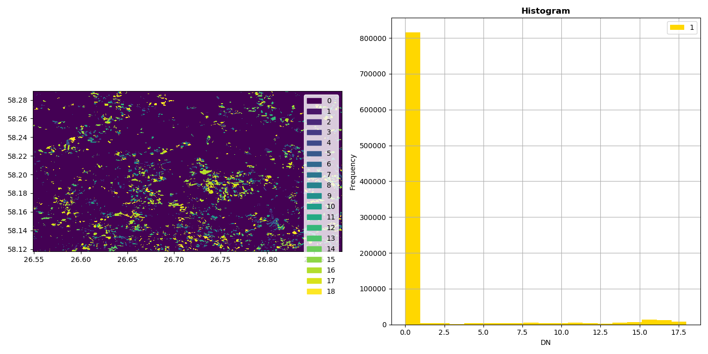

Reproject a raster
------------------

As we learned before, in order to perform meaning spatial operations and analyses, we need to make sure that our spatial datasets are in the same coordinate reference system.
In addition, if we want to make assumptions about distances or areas we should consider using a projected coordinate reference system that has its units of measurement defined in e.g. metres.
This is the same for raster data, where each pixel represents a certain area. Typically, all pixels are assumed to represent the same size.

In order to reproject a raster, we have to get a bit more involved. But before we get in-depth, a short side-note on Python resources handling. When files are opened, they are controlled by the Python process through a so called filehandle.
If these filehandles are not closed properly, it can cause problems, such as data not been written to the harddisk, several filehandles looking at the same file causing undefind behaviour, or general resource-shortage, which becomes a problem, when many thousands of files are opened but not closed.

In Python we can open a file and work with it like so:

.. code:: python

    fh = open("data.csv", "rw"):
    for lines in fh.readlines():
        do_something()
    fh.write("new data,1,2,3\n")
    # fh.flush()
    fh.close()

``fh`` represents the filehandle. Once it is open, it will be around for the lifetime of your program or Python session. If you use it later again, you should make sure, that your data is always written properly, e.g. with the `` flush()`` method.

Python provides also a more "sophisticated" way, in the form similar to the "for" comprehensions that we use to go over lists, etc. Here Python manages not the iterating for us, but the opening and closing of the file.
Everything in the ``with`` block below is safe, and once the block is completed, the ``flush`` and ``close`` are managed by Python and the file is safely and reliably written and closed. We will see this pattern today occasionally. 

.. code:: python

    with open("data.csv") as fh:
        fh.read()
        fh.write()
    
    # done, no flush or close necessary

Now let's reproject the forest loss example tif from WGS84 to the Estonian grid 1997, aka EPSG:3301. FYI, We are still using the same `example tif raster file forest_loss_porijogi_wgs84.tif <../_static/data/L4/forest_loss_porijogi_wgs84.tif>`_.

.. ipython:: python

    import numpy as np
    import rasterio
    from rasterio.warp import calculate_default_transform, reproject, Resampling

    dst_crs = 'EPSG:3301'

    with rasterio.open('source/_static/data/L4/forest_loss_porijogi_wgs84.tif') as src:
        transform, width, height = calculate_default_transform(src.crs, dst_crs, src.width, src.height, *src.bounds)
        kwargs = src.meta.copy()
        kwargs.update({
            'crs': dst_crs,
            'transform': transform,
            'width': width,
            'height': height
        })
        with rasterio.open('source/_static/data/L4/forest_loss_porijogi_3301.tif', 'w', **kwargs) as dst:
            for i in range(1, src.count + 1):
                reproject(
                    source=rasterio.band(src, i),
                    destination=rasterio.band(dst, i),
                    src_transform=src.transform,
                    src_crs=src.crs,
                    dst_transform=transform,
                    dst_crs=dst_crs,
                    resampling=Resampling.nearest)

A lot of stuff happened here:

1. We do the imports and then we define our target CRS. No surprises here. Then we open a first ``with`` block to open our source dataset.
2. we calculate a standard transformation (the pre-calculation so to say) ``calculate_default_transform`` with the information from source dataset and the taret CRS.
3. We copy the metadata from the original source dataset into a dictionary object ``kwargs`` (keyword arguments, just a structure with additional parameters and values)
4. We update some important information in the kwargs object, in particular the newly calulated values for transform and CRS
5. We are still within the first ``with`` block for reading the source, and now open a nested new ``with`` block for writing the projected data to file.
6. For each band then we do the actual ``reproject`` with the calculated parameters from source to destination.

Let's open the written file to look at it.

.. code::

    # quickly load and check
    with rasterio.open('source/_static/data/L4/forest_loss_porijogi_3301.tif', 'r') as data2:
        print(data2.profile)
        show(data2, cmap=cmap)

.. ipython:: python
    :suppress:
    :okwarning:

    data2 = rasterio.open('source/_static/data/L4/forest_loss_porijogi_3301.tif', 'r')
    print(data2.profile)
    show(data2, cmap=cmap)
    @savefig forest_loss_porijogi_3301.png width=7in
    plt.tight_layout()

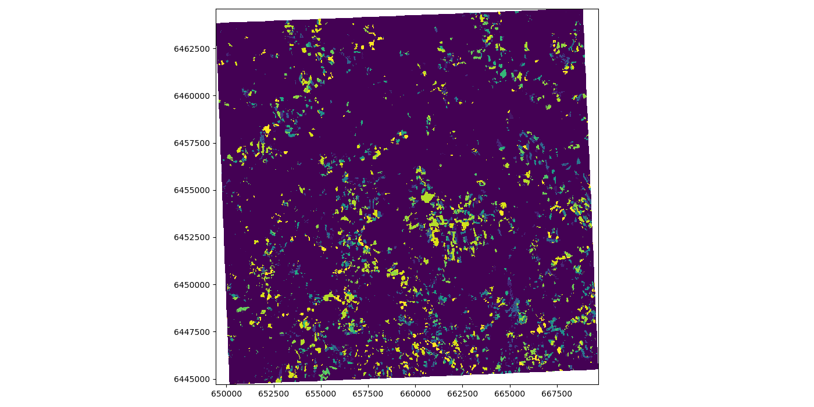

More details: https://rasterio.readthedocs.io/en/stable/topics/reproject.html

Clipping a raster
-----------------

One common task in raster processing is to clip raster files based on a Polygon. 
We will reuse the Porijõgi GeoJSON-file from last lecture or `download here porijogi_sub_catchments.geojson <../_static/data/L3/porijogi_sub_catchments.geojson>`_.

At first let's juts quickly load and look at the vector dataset.
.. ipython:: python

    import geopandas as gpd

    catchments = gpd.read_file('source/_static/data/L4/porijogi_sub_catchments.geojson')

    print(catchments.crs)
    print(catchments.head(5))

    # plot to quickly again to see its geographic layout
    catchments.plot()
    @savefig porijogi_sub_catchments.png width=7in
    plt.tight_layout()

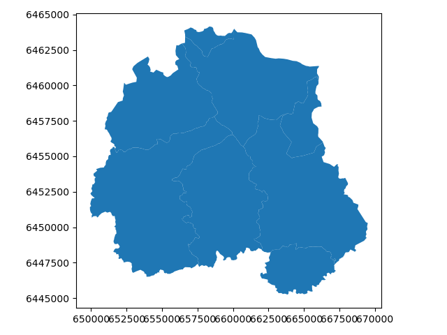

In order to use the features, technically only the polygon geometries, for clipping in Rasterio, we need to provide them in a slightly more low-level format.
We remember that the ``fiona`` library works actually under the hood of our now well-known Geopandas library. With fiona we can open vector/feature datasets directly without loading them into a dataframe.
Here we extract the "low-level" geometry object with fiona in order to obtain our vector mask.

.. ipython:: python

    import fiona 

    with fiona.open("source/_static/data/L4/porijogi_sub_catchments.geojson", "r") as vectorfile:
        shapes = [feature["geometry"] for feature in vectorfile]

With this list ``shapes`` tha twe just created we can pass the polygons to the ``mask`` function of Rasterio to do the clipping.
The clipping itself is pretty straightfoward. Here we demonstrate the opening of the raster dataset without a ``with`` block, so simply opening it and working with the filehandle thereof, and eventually closing it again.

.. ipython:: python

    from rasterio.mask import mask

    # we have to use the newly created reprojected raster file
    data2 = rasterio.open('source/_static/data/L4/forest_loss_porijogi_3301.tif', 'r')

    # Clip the raster with Polygon
    out_image, out_transform = mask(dataset=data2, shapes=shapes, crop=True)

    out_meta = data2.meta.copy()

    data2.close()

The whole work during the clipping process is very similar to the reprojecting workflow. As we change the dimension of the raster data, because we are literally clipping stuff off it, we have to retrieve a new transform together with the raw data.
We keep some of the original meta information again, but we update of course dimensions and transform before we write the new dataset to file.

.. ipython:: python

    print(out_meta)

    out_meta.update({"driver": "GTiff",
                 "height": out_image.shape[1],
                 "width": out_image.shape[2],
                 "transform": out_transform})

    with rasterio.open("source/_static/data/L4/forest_loss_clipped.tif", "w", **out_meta) as dest:
        dest.write(out_image)

And let's load the newly created clipped raster:

.. code::

    # quickly load and check
    with rasterio.open('source/_static/data/L4/forest_loss_clipped.tif.tif', 'r') as data3:
        print(data3.profile)
        show(data3, cmap=cmap)

.. ipython:: python
    :suppress:
    :okwarning:

    data3 = rasterio.open("source/_static/data/L4/forest_loss_clipped.tif", "r")
    print(data3.profile)
    show(data3)
    @savefig forest_loss_clipped.png width=7in
    plt.tight_layout()

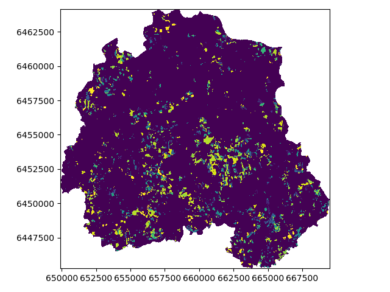

More details: https://rasterio.readthedocs.io/en/stable/topics/masking-by-shapefile.html

Calculating zonal statistics
----------------------------

Often we want to summarize raster datasets based on vector geometries, such as calculating the average elevation of specific area or aggregating summaries of areas or other count-based statistics per pixel under given polygons.
`Rasterstats <https://pythonhosted.org/rasterstats/index.html>`_ is a Python module that works on top of Rasterio and does exactly that.

Continuous raster are representing a continuous surface of the distribution of a phenomenon in space - e.g. elevation or temperature. DEMs are continuous rasters and now we want to look at a Digital Elevation Model (DEM) raster file: `dem.tif <../_static/data/L4/dem.tif>`_. 

We are again reusing the Porijõgi GeoJSON-file from last lecture: `porijogi_sub_catchments.geojson <../_static/data/L3/porijogi_sub_catchments.geojson>`_. These will be our polygons for which we want to aggregate summary statistics from the DEM raster.

.. ipython:: python

    import geopandas as gpd
    catchments = gpd.read_file('source/_static/data/L4/porijogi_sub_catchments.geojson')

Now let's open the DEM and inspect its attributes:

.. ipython:: python

    demdata = rasterio.open('source/_static/data/L4/dem.tif')

    print(demdata.name)
    print(demdata.mode)
    print(demdata.count)
    print(demdata.width)
    print(demdata.height)
    print(demdata.crs)
    print(demdata.bounds)

And we can also plot vector features and raster datasets together:
Again, we make sure we are plotting on top of the same "axes", we use the Rasterio ``show`` function and tell it to plot the the first band in the ``demdata`` dataset, and then we plot our Geopandas dataframe on top of it.
We have to be sure of course, that our datasets are in the same spatial coordinate reference system.

.. ipython:: python
    :okwarning:

    fig, ax = plt.subplots(1, figsize=(9, 7))

    show((demdata, 1), cmap='terrain', interpolation='none', ax=ax)

    catchments.plot(ax=ax, facecolor="none", edgecolor='black', lw=0.7)

    plt.title("Elevation in the Porijogi catchment")

    plt.show()
    @savefig dem_pori_catch.png width=7in
    plt.tight_layout()

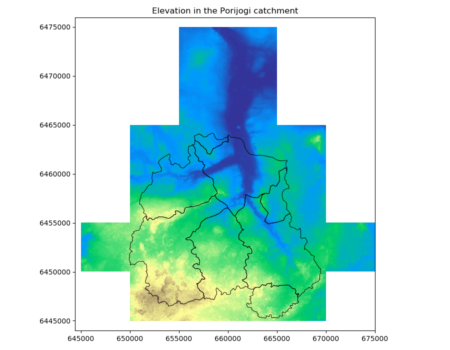

Importing and calling the zonal statistics function from the Rasterstats module is very easy. However, we have to be aware that we directly refer to the file paths of the datasets, and not to a variable containing a numpy array or dataframe!
We can name the desired statistics via the ``stats`` parameter. `Check the detailed API <https://pythonhosted.org/rasterstats/manual.html#zonal-statistics>`_ which statistics are available.

.. ipython:: python

    from rasterstats import zonal_stats

    zs = zonal_stats('source/_static/data/L4/porijogi_sub_catchments.geojson', 'source/_static/data/L4/dem.tif', stats=['mean','std'])
    print(zs)

The ``zs`` variable is a list of dictionary objects that holds the calculated statistics for each feature/polygon in the same order.
So we have to rely on the order of the features in the source GeoJSON file for the zonal_statistics to be the same as in our Geopandas dataframe.
But because *computers* we can, and we make this a list into a Pandas dataframe and just concat (join/merge by merely "plucking it onto") as additional columns.

.. ipython:: python

    import pandas as pd

    demstats_df = pd.DataFrame(zs)

    demstats_df.rename(columns={'mean':'dem_mean','std':'dem_std'}, inplace=True)

    catchments = pd.concat([catchments, demstats_df], axis=1)

We also rename the columns to be more explicit of the meaning of the calculated variable. Finally, we plot our catchments geodataframe based on the ``dem_mean`` column.
The distribution of mean elevation within the catchment makes sense, the outlet is in the North-East.

.. ipython:: python

    fig, ax = plt.subplots(1, 1)

    plt.title("Mean elevation per subcatchment")

    catchments.plot(column='dem_mean', ax=ax, legend=True)
    @savefig dem_pori_catch_mean.png width=7in
    plt.tight_layout()

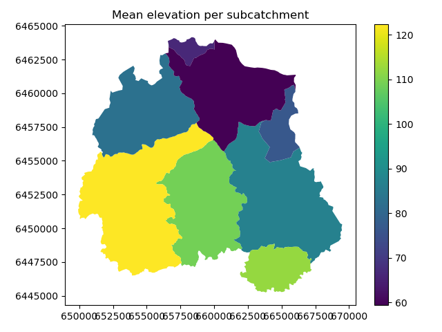

.. ipython:: python
    :suppress:

    plt.close('all')

**Launch in the web/MyBinder:**

.. image:: https://mybinder.org/badge_logo.svg
     :target: https://mybinder.org/v2/gh/LandscapeGeoinformatics/geopython-ut-2019/master?filepath=L4%2Flesson4.ipynb
