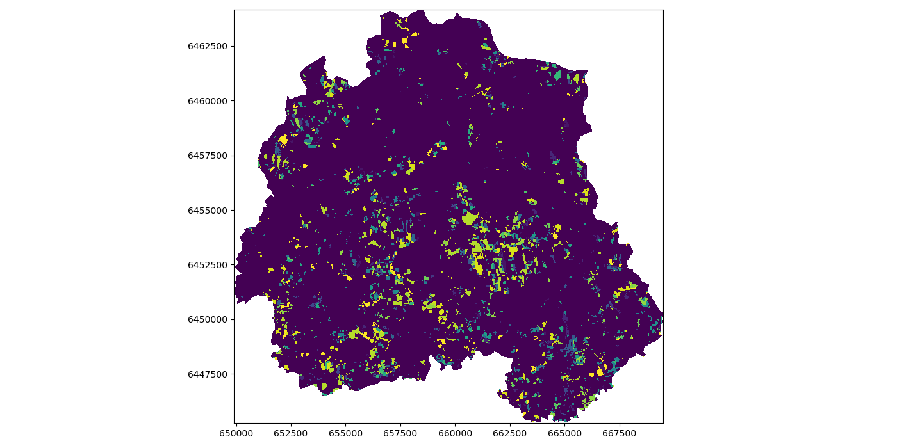

Working with Raster data
========================

https://rasterio.readthedocs.io/en/stable/

Exploring and visualisation of raster data
------------------------------------------

Download `example tif raster file forest_loss_porijogi_wgs84.tif <../_static/data/L4/forest_loss_porijogi_wgs84.tif>`_

.. ipython:: python

    import rasterio
    dataset = rasterio.open('source/_static/data/L4/forest_loss_porijogi_wgs84.tif')

.. ipython:: python

    print(dataset.name)
    print(dataset.mode)
    print(dataset.count)
    print(dataset.width)
    print(dataset.height)
    print(dataset.crs)
    print(dataset.bounds)

.. ipython:: python
    
    print(dataset.profile)

.. ipython:: python

    print(dataset.transform)

    for i in range(len(dataset.indexes) ):
        print("{}: {}".format(i, dataset.dtypes[i]))

.. ipython:: python

    # reading the first band (not from zero!)
    band1 = dataset.read(1)
    band1

.. ipython:: python
    :okwarning:

    import matplotlib.pyplot as plt
    # add this in your Jupyter Notebook too
    # %matplotlib inline
    
    plt.imshow(band1)
    @savefig forest-loss-year1.png width=7in
    plt.tight_layout()

.. image:: ../_static/img/forest-loss-year1.png

.. ipython:: python
    :okwarning:

    from rasterio.plot import show
    # show(band1)
    # show((dataset, 1))
    show(dataset)
    @savefig forest-loss-year2.png width=7in
    plt.tight_layout()

.. image:: ../_static/img/forest-loss-year2.png

.. ipython:: python

    import numpy as np

    # get classes
    uniq_vals = np.unique(band1)

    # display sorted order
    print(sorted(uniq_vals))  

    # Patches = the matplotlib objects drawn
    counts, bins = np.histogram(band1, bins=18)

    # Print histogram outputs
    for i in range(len(bins)-1):
        print("bin lower bound:", bins[i])
        print("counts:", counts[i])

.. ipython:: python
    :okwarning:

    from matplotlib.patches import Patch
    from matplotlib.colors import BoundaryNorm
    from matplotlib import rcParams, cycler

    fig, ax = plt.subplots()

    cmap = plt.cm.viridis
    lst = [int(x) for x in np.linspace(0,255,19)]
    legend_patches = [Patch(color=icolor, label=label) for icolor, label in zip( cmap(lst), sorted(uniq_vals))]

    ax.legend(handles=legend_patches, facecolor="white", edgecolor="white", bbox_to_anchor=(1.35, 1))

    plt.imshow(band1, cmap=cmap, interpolation='nearest')
    @savefig forest-loss-year3.png width=7in
    plt.tight_layout()

.. image:: ../_static/img/forest-loss-year3.png

.. ipython:: python
    :okwarning:

    from rasterio.plot import show_hist

    show_hist(dataset, bins=19, lw=0.0, stacked=False, alpha=0.3, histtype='stepfilled', title="Histogram")
    @savefig forest-loss-hist1.png width=7in
    plt.tight_layout()

.. image:: ../_static/img/forest-loss-hist1.png

.. ipython:: python
    :okwarning:

    fig, (ax_dat, ax_hist) = plt.subplots(1, 2, figsize=(14,7))

    ax_dat.legend(handles=legend_patches, facecolor="white", edgecolor="white")

    show((dataset, 1), ax=ax_dat)

    show_hist((dataset, 1), bins=19, ax=ax_hist)

    plt.show()
    @savefig forest-loss-hist2.png width=11in
    plt.tight_layout()

.. image:: ../_static/img/forest-loss-hist2.png

Reproject a raster
------------------

.. code:: python

    fh = open("data.csv", "rw"):
    for lines in fh.readlines():
        do_something()
    fh.write("new data,1,2,3\n")
    # fh.flush()
    fh.close()

.. code:: python

    with open("data.csv") as fh:
        fh.read()
        fh.write()
    
    # done, no flush or close necessary

We are still using the same `example tif raster file forest_loss_porijogi_wgs84.tif <../_static/data/L4/forest_loss_porijogi_wgs84.tif>`_.

.. ipython:: python

    import numpy as np
    import rasterio
    from rasterio.warp import calculate_default_transform, reproject, Resampling

    dst_crs = 'EPSG:3301'

    with rasterio.open('source/_static/data/L4/forest_loss_porijogi_wgs84.tif') as src:
        transform, width, height = calculate_default_transform(
            src.crs, dst_crs, src.width, src.height, *src.bounds)
        kwargs = src.meta.copy()
        kwargs.update({
            'crs': dst_crs,
            'transform': transform,
            'width': width,
            'height': height
        })
        with rasterio.open('source/_static/data/L4/forest_loss_porijogi_3301.tif', 'w', **kwargs) as dst:
            for i in range(1, src.count + 1):
                reproject(
                    source=rasterio.band(src, i),
                    destination=rasterio.band(dst, i),
                    src_transform=src.transform,
                    src_crs=src.crs,
                    dst_transform=transform,
                    dst_crs=dst_crs,
                    resampling=Resampling.nearest)

.. code::

    # quickly load and check
    with rasterio.open('source/_static/data/L4/forest_loss_porijogi_3301.tif', 'r') as data2:
        print(data2.profile)
        show(data2, cmap=cmap)

.. ipython:: python
    :suppress:
    :okwarning:

    data2 = rasterio.open('source/_static/data/L4/forest_loss_porijogi_3301.tif', 'r')
    print(data2.profile)
    show(data2, cmap=cmap)
    @savefig forest_loss_porijogi_3301.png width=7in
    plt.tight_layout()

.. image:: ../_static/img/forest_loss_porijogi_3301.png

Clipping a raster
-----------------

https://rasterio.readthedocs.io/en/stable/topics/masking-by-shapefile.html

Reuse the Porijõgi GeoJSON-file from last lecture or `download here porijogi_sub_catchments.geojson <../_static/data/L3/porijogi_sub_catchments.geojson>`_.

.. ipython:: python

    import geopandas as gpd

    catchments = gpd.read_file('source/_static/data/L4/porijogi_sub_catchments.geojson')

    print(catchments.crs)
    print(catchments.head(5))

    # plot to quickly again to see its geographic layout
    catchments.plot()
    @savefig porijogi_sub_catchments.png width=7in
    plt.tight_layout()

.. image:: ../_static/img/porijogi_sub_catchments.png

.. ipython:: python

    import fiona 

    with fiona.open("source/_static/data/L4/porijogi_sub_catchments.geojson", "r") as vectorfile:
        shapes = [feature["geometry"] for feature in vectorfile]

.. ipython:: python

    from rasterio.mask import mask

    # we have to use the newly created reprojected raster file
    data2 = rasterio.open('source/_static/data/L4/forest_loss_porijogi_3301.tif', 'r')

    # Clip the raster with Polygon
    out_image, out_transform = mask(dataset=data2, shapes=shapes, crop=True)

    out_meta = data2.meta.copy()

    data2.close()

.. ipython:: python

    print(out_meta)

    out_meta.update({"driver": "GTiff",
                 "height": out_image.shape[1],
                 "width": out_image.shape[2],
                 "transform": out_transform})

    with rasterio.open("source/_static/data/L4/forest_loss_clipped.tif", "w", **out_meta) as dest:
        dest.write(out_image)

.. code::

    # quickly load and check
    with rasterio.open('source/_static/data/L4/forest_loss_clipped.tif.tif', 'r') as data3:
        print(data3.profile)
        show(data3, cmap=cmap)

.. ipython:: python
    :suppress:
    :okwarning:

    data3 = rasterio.open("source/_static/data/L4/forest_loss_clipped.tif", "r")
    print(data3.profile)
    show(data3)
    @savefig forest_loss_clipped.png width=7in
    plt.tight_layout()

Calculating zonal statistics
----------------------------

https://pythonhosted.org/rasterstats/index.html

We are agaim reusing the Porijõgi GeoJSON-file from last lecture: `porijogi_sub_catchments.geojson <../_static/data/L3/porijogi_sub_catchments.geojson>`_.

But in additiona, we need to load a Digital Elevation Model (DEM) raster file: `dem.tif <../_static/data/L4/dem.tif>`_.

.. ipython:: python

    import geopandas as gpd
    catchments = gpd.read_file('source/_static/data/L4/porijogi_sub_catchments.geojson')

.. ipython:: python

    demdata = rasterio.open('source/_static/data/L4/dem.tif')

    print(demdata.name)
    print(demdata.mode)
    print(demdata.count)
    print(demdata.width)
    print(demdata.height)
    print(demdata.crs)
    print(demdata.bounds)

.. ipython:: python
    :okwarning:

    fig, ax = plt.subplots(1, figsize=(9, 7))

    show((demdata, 1), cmap='terrain', interpolation='none', ax=ax)

    catchments.plot(ax=ax, facecolor="none", edgecolor='black', lw=0.7)

    plt.title("Elevation in the Porijogi catchment")

    plt.show()
    @savefig dem_pori_catch.png width=7in
    plt.tight_layout()

.. image:: ../_static/img/dem_pori_catch.png

.. ipython:: python

    from rasterstats import zonal_stats

    zs = zonal_stats('source/_static/data/L4/porijogi_sub_catchments.geojson', 'source/_static/data/L4/dem.tif', stats=['mean','std'])
    print(zs)

.. ipython:: python

    import pandas as pd

    demstats_df = pd.DataFrame(zs)

    demstats_df.rename(columns={'mean':'dem_mean','std':'dem_std'}, inplace=True)

    catchments = pd.concat([catchments, demstats_df], axis=1)

.. ipython:: python

    fig, ax = plt.subplots(1, 1)

    plt.title("Mean elevation per subcatchment")

    catchments.plot(column='dem_mean', ax=ax, legend=True)
    @savefig dem_pori_catch_mean.png width=7in
    plt.tight_layout()

.. image:: ../_static/img/dem_pori_catch_mean.png

**Launch in the web/MyBinder:**

.. image:: https://mybinder.org/badge_logo.svg
     :target: https://mybinder.org/v2/gh/LandscapeGeoinformatics/geopython-ut-2019/master?filepath=L4%2Flesson4.ipynb
