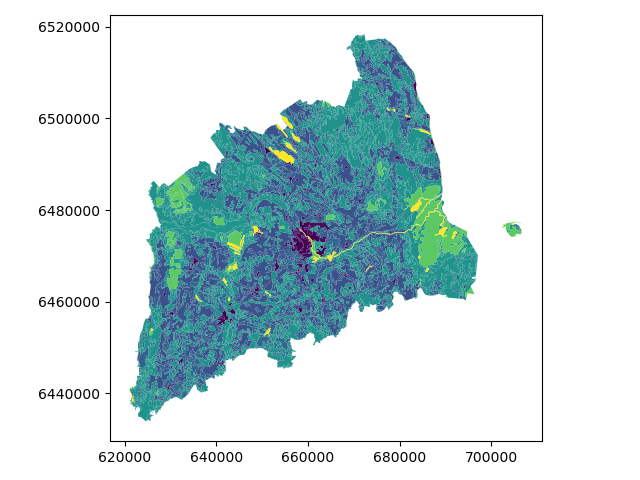
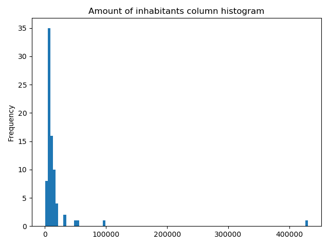

Data reclassification
=====================

Reclassifying data based on specific criteria is a common task when doing GIS analysis.
The purpose of this lesson is to see how we can reclassify values based on some criteria which can be whatever, such as:

.. code::

    1. if available space in a pub is less than the space in my wardrobe

    AND

    2. the temperature outside is warmer than my beer

    ------------------------------------------------------

    IF TRUE: ==> I go and drink my beer outside
    IF NOT TRUE: ==> I go and enjoy my beer inside at a table

Even though, the above would be an interesting study case, we will use slightly more traditional cases to learn classifications.
We will use Corine land cover layer from year 2012, and a Population Matrix data from Estonia to classify some features of them based on our own
self-made classifier, or using a ready made classifiers that are commonly used e.g. when doing visualizations.

The target in this part of the lesson is to:

- classify the bogs into big and small bogs where
- a big bog is a bog that is larger than the average size of all bogs in our study region
- a small bog ^ vice versa
- use ready made classifiers from pysal -module to classify municipal into multiple classes.

Download data
-------------

Download (and then extract) the dataset zip-package used during this lesson `from this link <../_static/data/L5/L5.zip>`_.

You should have following Shapefiles in your ``L5`` folder:

.. code::

    corine_legend/    corine_tartu.shp            population_admin_units.prj
    corine_tartu.cpg  corine_tartu.shp.xml        population_admin_units.sbn
    corine_tartu.dbf  corine_tartu.shx            population_admin_units.sbx
    corine_tartu.prj  L5.zip                      population_admin_units.shp
    corine_tartu.sbn  population_admin_units.cpg  population_admin_units.shp.xml
    corine_tartu.sbx  population_admin_units.dbf  population_admin_units.shx

Data preparation
----------------

Before doing any classification, we need to prepare our data a little bit.

Let's read the data in and have a look at the columnsand plot our data so that we can see how it looks like on a map.

.. ipython:: python

    import pandas as pd
    import geopandas as gpd
    import matplotlib.pyplot as plt
    import os

    fp = "source/_static/data/L5/corine_tartu.shp"
    data = gpd.read_file(fp)

.. code::

    # in Jupyter Notebook don't forget to enable the inline plotting magic
    import matplotlib.pyplot as plt
    %matplotlib inline

Let's see what we have.

.. ipython:: python

   data.head(5)

We see that the Land Use in column "code_12" is numerical and we don't know right now what that means.
So we should at first join the "clc_legend" in order to know what the codes mean:

.. ipython:: python

    fp_clc = "source/_static/data/L5/corine_legend/clc_legend.csv"
    data_legend = pd.read_csv(fp_clc, sep=';', encoding='latin1')
    data_legend.head(5)

We could now try to merge / join the two dataframes, ideally by the 'code_12' column of "data" and the "CLC_CODE" of "data_legend".

.. ipython:: python

    display(data.dtypes)
    display(data_legend.dtypes)
    # please don't actually do it right now, it might cause extra troubles later
    # data = data.merge(data_legend, how='inner', left_on='code_12', right_on='CLC_CODE')

But if we try, we will receive an error telling us that the columns are of different data type and therefore can't be used as join-index.
So we have to add a column where have the codes in the same type. I am choosing to add a column on "data", where we transform the String/Text based "code_12" into an integer number.

.. ipython:: python

    def change_type(row):
        code_as_int = int(row['code_12'])
        return code_as_int

.. ipython:: python

    data['clc_code_int'] = data.apply(change_type, axis=1)
    data.head(2)

Here we are "casting" the String-based value, which happens to be a number, to be interpreted as an actula numeric data type.
Using the  ``int()`` function. Pandas (and therefore also Geopandas) also provides an in-built function that provides similar functionality `astype() <https://pandas.pydata.org/pandas-docs/stable/generated/pandas.DataFrame.astype.html>`_ ,
e.g. like so ``data['code_astype_int'] = data['code_12'].astype('int64', copy=True)``

Both versions can go wrong if the String cannot be interpreted as a number, and we should be more defensive (more details later, don't worry right now).

Now we can merge/join the legend dateframe into our corine landuse dataframe:

.. ipython:: python

    data = data.merge(data_legend, how='inner', left_on='clc_code_int', right_on='CLC_CODE', suffixes=('', '_legend'))

We have now also added more columns. Let's drop a few, so we can focus on the data we need.

.. ipython:: python

    selected_cols = ['ID','Remark','Shape_Area','CLC_CODE','LABEL3','RGB','geometry']

    # Select data
    data = data[selected_cols]

    # What are the columns now?
    data.columns

Before we plot, let's check the coordinate system.

.. ipython:: python

    # Check coordinate system information
    data.crs

Okey we can see that the units are in meters, but ...

... geographers will realise that the Corine dataset is in the `ETRS89 / LAEA Europe coordinate system, aka EPSG:3035 <http://spatialreference.org/ref/epsg/etrs89-etrs-laea/>`_.
Because it is a European dataset it is in the recommended CRS for Europe-wide data. It is a single CRS for all of Europe and predominantly used for statistical mapping at all scales and other purposes where **true area representation is required**.

However, being in Estonia and only using an Estonian part of the data, we should consider reprojecting it into the Estonian national grid (aka Estonian Coordinate System of 1997 -> EPSG:3301) before we plot or calculate the area of our bogs.

.. ipython:: python

    data_proj = data.to_crs(epsg=3301)
    # Calculate the area of bogs
    data_proj['area'] = data_proj.area

    # What do we have?
    data_proj['area'].head(2)

Let's plot the data and use column 'CLC_CODE' as our color.

.. ipython:: python

    data_proj.plot(column='CLC_CODE', linewidth=0.05)

    # Use tight layout and remove empty whitespace around our map
    @savefig corine-CLC_CODE.png width=7in
    plt.tight_layout()

Let's see what kind of values we have in 'code_12' column.

.. ipython:: python

    print(list(data_proj['CLC_CODE'].unique()))
    print(list(data_proj['LABEL3'].unique()))

Okey we have different kind of land covers in our data. Let's select only bogs from our data. Selecting specific rows from a DataFrame
based on some value(s) is easy to do in Pandas / Geopandas using the indexer called ``.loc[]``, read more from `here <http://pandas.pydata.org/pandas-docs/stable/indexing.html#different-choices-for-indexing>`_.

.. ipython:: python

    # Select bogs (i.e. 'Peat bogs' in the data) and make a proper copy out of our data
    bogs = data_proj.loc[data['LABEL3'] == 'Peat bogs'].copy()
    bogs.head(2)

Calculations in DataFrames
--------------------------

Okey now we have our bogs dataset ready. The aim was to classify those bogs into small and big bogs based on **the average size of all bogs** in our
study area. Thus, we need to calculate the average size of our bogs.

We remember also that the CRS was projected with units in metre, and the calculated values are therefore be in square meters. Let's change those into square kilometers so they are easier to read.
Doing calculations in Pandas / Geopandas are easy to do:

.. ipython:: python

    bogs['area_km2'] = bogs['area'] / 1000000

    # What is the mean size of our bogs?
    l_mean_size = bogs['area_km2'].mean()
    l_mean_size

Okey so the size of our bogs seem to be approximately 2.15 square kilometers.

But to understand the overall distribution of the different sizes of the bogs, we can use the `histogram <https://pandas.pydata.org/pandas-docs/stable/generated/pandas.DataFrame.plot.hist.html>`_.
A histogram shows how the numerical values of a datasets are distributed within the overall data.
It shows the frequency of values (how many single "features") are within each "bin".

.. ipython:: python

    # Plot
    fig, ax = plt.subplots()

    bogs['area_km2'].plot.hist(bins=10);

    # Add title
    plt.title("Bogs area_km2 histogram")
    @savefig bogs_area_histogram.png width=7in
    plt.tight_layout()

.. note::

   It is also easy to calculate e.g. sum or difference between two or more layers (plus all other mathematical operations), e.g.:

   .. code:: python

      # Sum two columns
      data['sum_of_columns'] = data['col_1'] + data['col_2']

      # Calculate the difference of three columns
      data['difference'] = data['some_column'] - data['col_1'] + data['col_2']

Classifying data
----------------

Creating a custom classifier
~~~~~~~~~~~~~~~~~~~~~~~~~~~~

Let's create a function where we classify the geometries into two classes based on a given ``threshold`` -parameter.
If the area of a polygon is lower than the threshold value (average size of the bog), the output column will get a value 0,
if it is larger, it will get a value 1. This kind of classification is often called a `binary classification <https://en.wikipedia.org/wiki/Binary_classification>`_.

First we need to create a function for our classification task. This function takes a single row of the GeoDataFrame as input,
plus few other parameters that we can use.

.. code::

   def binaryClassifier(row, source_col, output_col, threshold):
       # If area of input geometry is lower that the threshold value
       if row[source_col] < threshold:
           # Update the output column with value 0
           row[output_col] = 0
       # If area of input geometry is higher than the threshold value update with value 1
       else:
           row[output_col] = 1
       # Return the updated row
       return row

.. ipython:: python

    def binaryClassifier(row, source_col, output_col, threshold):
        # If area of input geometry is lower that the threshold value
        if row[source_col] < threshold:
            # Update the output column with value 0
            row[output_col] = 0
        # If area of input geometry is higher than the threshold value update with value 1
        else:
            row[output_col] = 1
        # Return the updated row
        return row

Let's create an empty column for our classification

.. ipython:: python

    bogs['small_big'] = None

We can use our custom function by using a Pandas / Geopandas function called ``.apply()``.
Thus, let's apply our function and do the classification.

.. ipython:: python

    bogs = bogs.apply(binaryClassifier, source_col='area_km2', output_col='small_big', threshold=l_mean_size, axis=1)

Let's plot these bogs and see how they look like.

.. ipython:: python

    bogs.plot(column='small_big', linewidth=0.05, cmap="seismic")

    @savefig small-big-bogs.png width=6in
    plt.tight_layout()

Okey so it looks like they are correctly classified, good. As a final step let's save the bogs as a file to disk.

.. ipython:: python

    outfp_bogs = "source/_static/data/L5/bogs.shp"
    bogs.to_file(outfp_bogs)

.. note::

   There is also a way of doing this without a function but with the previous example might be easier to understand how the function works.
   Doing more complicated set of criteria should definitely be done in a function as it is much more human readable.

   Let's give a value 0 for small bogs and value 1 for big bogs by using an alternative technique:

   .. code:: python

      bogs['small_big_alt'] = None
      bogs.loc[bogs['area_km2'] < l_mean_size, 'small_big_alt'] = 0
      bogs.loc[bogs['area_km2'] >= l_mean_size, 'small_big_alt'] = 1

.. todo::

   **Task:**

   Try to change your classification criteria and see how your results change! Change the LandUse Code/Label and see how
   they change the results.

Classification based on common classification schemes
~~~~~~~~~~~~~~~~~~~~~~~~~~~~~~~~~~~~~~~~~~~~~~~~~~~~~

`Pysal <https://pysal.readthedocs.io/en/latest/index.html>`_ -module is an extensive Python library including various functions and tools to
do spatial data analysis. It also includes all of the most common data classification schemes that are used commonly e.g. when visualizing data.
Available map classification schemes in pysal -module are (`see here for more details <https://pysal.readthedocs.io/en/latest/api.html#pysal-viz-mapclassify-choropleth-map-classification>`_):

- Box_Plot: Box_Plot Map Classification
- Equal_Interval: Equal Interval Classification
- Fisher_Jenks: Fisher Jenks optimal classifier - mean based
- Fisher_Jenks_Sampled: Fisher Jenks optimal classifier - mean based using random sample
- HeadTail_Breaks: Head/tail Breaks Map Classification for Heavy-tailed Distributions
- Jenks_Caspall: Jenks Caspall Map Classification
- Jenks_Caspall_Forced: Jenks Caspall Map Classification with forced movements
- Jenks_Caspall_Sampled: Jenks Caspall Map Classification using a random sample
- Max_P_Classifier: Max_P Map Classification
- Maximum_Breaks(: Maximum Breaks Map Classification
- Natural_Breaks: Natural Breaks Map Classification
- Quantiles: Quantile Map Classification
- Percentiles: Percentiles Map Classification
- Std_Mean: Standard Deviation and Mean Map Classification
- User_Defined: User Specified Binning

For this we will use the Adminstrative Units dataset for population.
It is in the Estonian "vald" level, which compares to the level at municipality.
It has the following fields:

- VID, an Id for the "vald"
- KOOD, a unique code for the Statistics Board
- NIMI, the name of the municipality
- population, the population, number of people living
- geometry, the polygon for the municpality district border

Let's apply one of those schemes into our data and classify the population into 5 classes.

**Choosing Number of Classes** – if you choose too many classes then it requires the map reader to remember too much when viewing 
the map and it may also make the differentiation of class colors difficult for the map reader. 
On the other hand, if you choose too few classes, it oversimplifies the data possibly hiding important patterns. 
Additionally, each class may group dissimilar items together which is in direct opposition of one of the main goals of classification. 
Typically in cartography three to seven classes are preferred and five is the most common and optimal for most thematic maps.

.. ipython:: python

    import geopandas as gpd
    import matplotlib.pyplot as plt

    fp = "source/_static/data/L5/population_admin_units.shp"
    acc = gpd.read_file(fp)
    print(acc.head(5))

However, at a close look, we run into the "numbers as text problem" again.

.. ipython:: python

    # data types in the population dataset
    acc.dtypes

Therefore, we have to change the column type for population into a numerical data type first:

.. ipython:: python

    import numpy as np

    def change_type_defensively(row):
        try:
            return int(row['population'])
        except Exception:
            return np.nan
    acc['population_int'] = acc.apply(change_type_defensively, axis=1)
    acc.head(5)

Here we demonstrate a more defensive strategy to convert datatypes. Many operations can cause **Exceptions** and then you can't ignore the problem anymore because your code breaks.
But with ``try - except`` we can catch expected exception (aka crashes) and react appropriately.

Pandas (and therefore also Geopandas) also provides an in-built function that provides similar functionality `to_numeric() <https://pandas.pydata.org/pandas-docs/stable/generated/pandas.to_numeric.html#pandas.to_numeric>`_ ,
e.g. like so ``data['code_tonumeric_int'] = pd.to_numeric(data['code_12'], errors='coerce')``. Beware, ``to_numeric()`` is called as ``pandas/pd`` function, not on the dataframe.

Both versions will at least return a useful NaN value (not_a_number, sort of a nodata value) without crashing. Pandas, Geopandas, numpy and many other Python libraries have some functionality to work with or ignore Nan values without breaking calculations.

It would be great to know the actual class ranges for the values.
So let's plot a histogram.

.. ipython:: python

    # Plot
    fig, ax = plt.subplots()

    acc["population_int"].plot.hist(bins=100);

    # Add title
    plt.title("Amount of inhabitants column histogram")
    @savefig population_histogram.png width=7in
    plt.tight_layout()

Now we can apply a classifier to our data quite similarly as in our previous examples.

.. ipython:: python
    :okwarning:

    import pysal.viz.mapclassify as mc

    # Define the number of classes
    n_classes = 5

The classifier needs to be initialized first with ``make()`` function that takes the number of desired classes as input parameter.

.. ipython:: python

    # Create a Natural Breaks classifier
    classifier = mc.NaturalBreaks.make(k=n_classes)

Then we apply the classifier by explicitly providing it a column and then assigning the derived class values to a new column.

.. ipython:: python

    # Classify the data
    acc['population_classes'] = acc[['population_int']].apply(classifier)

    # Let's see what we have
    acc.head()

Okey, so we have added a column to our DataFrame where our input column was classified into 5 different classes (numbers 0-4) based on `Natural Breaks classification <http://wiki.gis.com/wiki/index.php/Jenks_Natural_Breaks_Classification>`_.

Great, now we have those values in our population GeoDataFrame. Let's visualize the results and see how they look.

.. ipython:: python

    # Plot
    acc.plot(column="population_classes", linewidth=0, legend=True);

    # Use tight layour
    @savefig natural_breaks_population.png width=7in
    plt.tight_layout()

In order to get the min() and max() per class group, we use **groupby** again.

.. ipython:: python

    grouped = acc.groupby('population_classes')

    # legend_dict = { 'class from to' : 'white'}
    legend_dict = {}

    for cl, valds in grouped:
        minv = valds['population_int'].min()
        maxv = valds['population_int'].max()
        print("Class {}: {} - {}".format(cl, minv, maxv))

And in order to add our custom legend info to the plot, we need to employ a bit more of Python's matplotlib magic:

.. ipython:: python

    import matplotlib.patches as mpatches
    import matplotlib.pyplot as plt
    import collections

    # legend_dict, a special ordered dictionary (which reliably remembers order of adding things) that holds our class description and gives it a colour on the legend (we leave it "background" white for now)
    legend_dict = collections.OrderedDict([])
    #
    for cl, valds in grouped:
        minv = valds['population_int'].min()
        maxv = valds['population_int'].max()
        legend_dict.update({"Class {}: {} - {}".format(cl, minv, maxv): "white"})
    # Plot preps for several plot into one figure
    fig, ax = plt.subplots()
    # plot the dataframe, with the natural breaks colour scheme
    acc.plot(ax=ax, column="population_classes", linewidth=0, legend=True);
    # the custom "patches" per legend entry of our additional labels
    patchList = []
    for key in legend_dict:
        data_key = mpatches.Patch(color=legend_dict[key], label=key)
        patchList.append(data_key)
    # plot the custom legend
    plt.legend(handles=patchList, loc='lower center', bbox_to_anchor=(0.5, -0.5), ncol=1)
    # Add title
    plt.title("Amount of inhabitants natural breaks classifier")
    @savefig natural_breaks_population_extra_labels.png width=7in
    plt.tight_layout()

.. ipython:: python
    :suppress:

    plt.close('all')

.. todo::

   **Task:**

   Try to test different classification methods 'Equal Interval', 'Quantiles', and 'Std_Mean' and visualise them.

**Launch in the web/MyBinder:**

.. image:: https://mybinder.org/badge_logo.svg
     :target: https://mybinder.org/v2/gh/LandscapeGeoinformatics/geopython-ut-2019/master?filepath=L5%2Flesson5.ipynb
