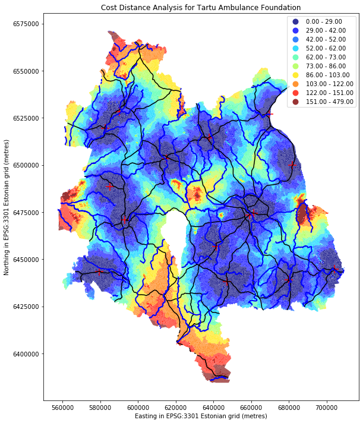
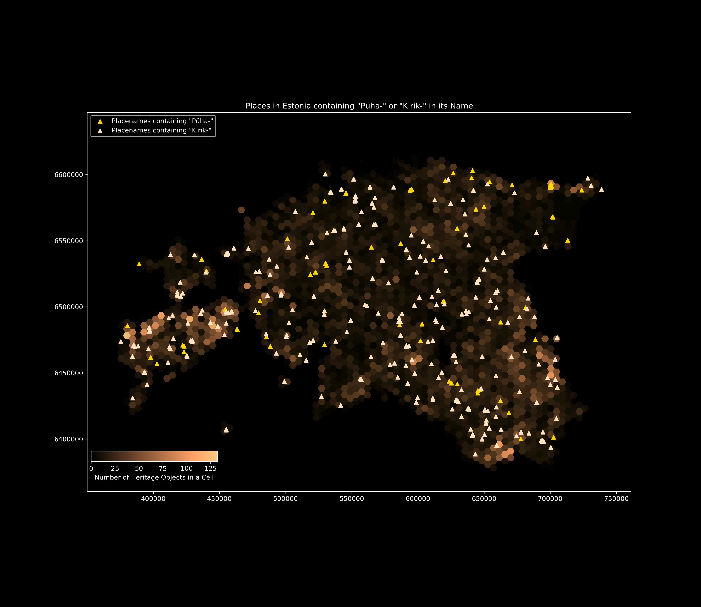
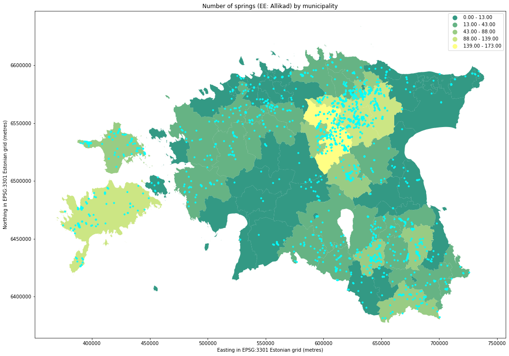
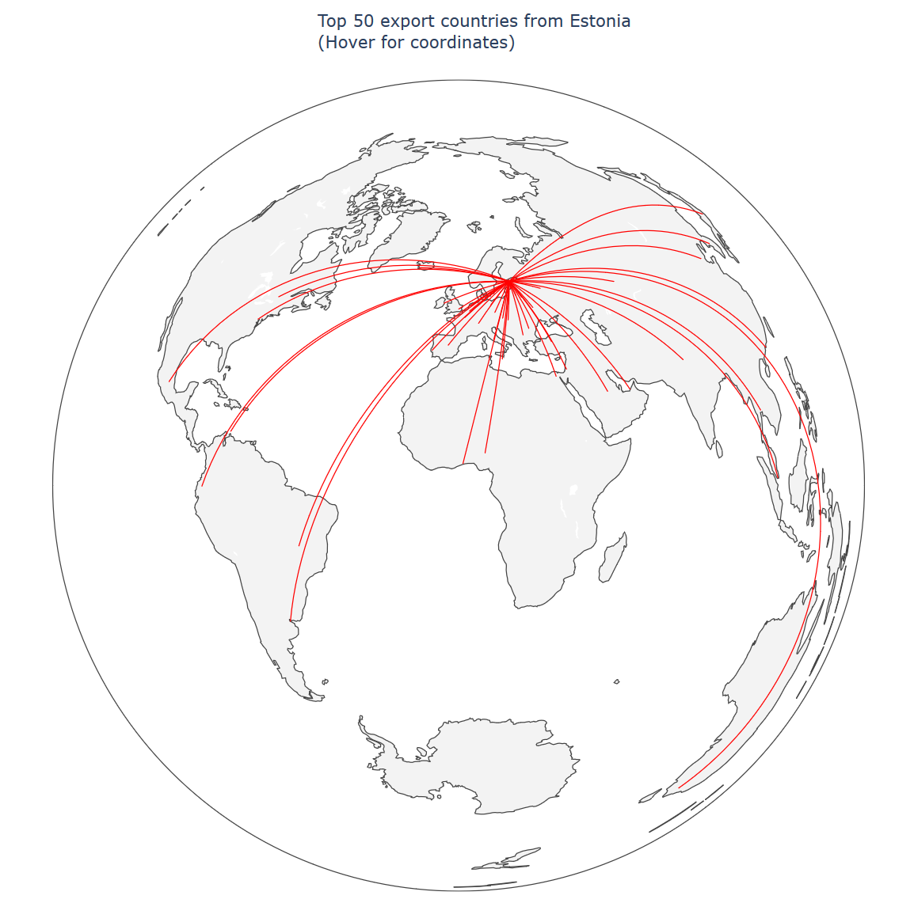
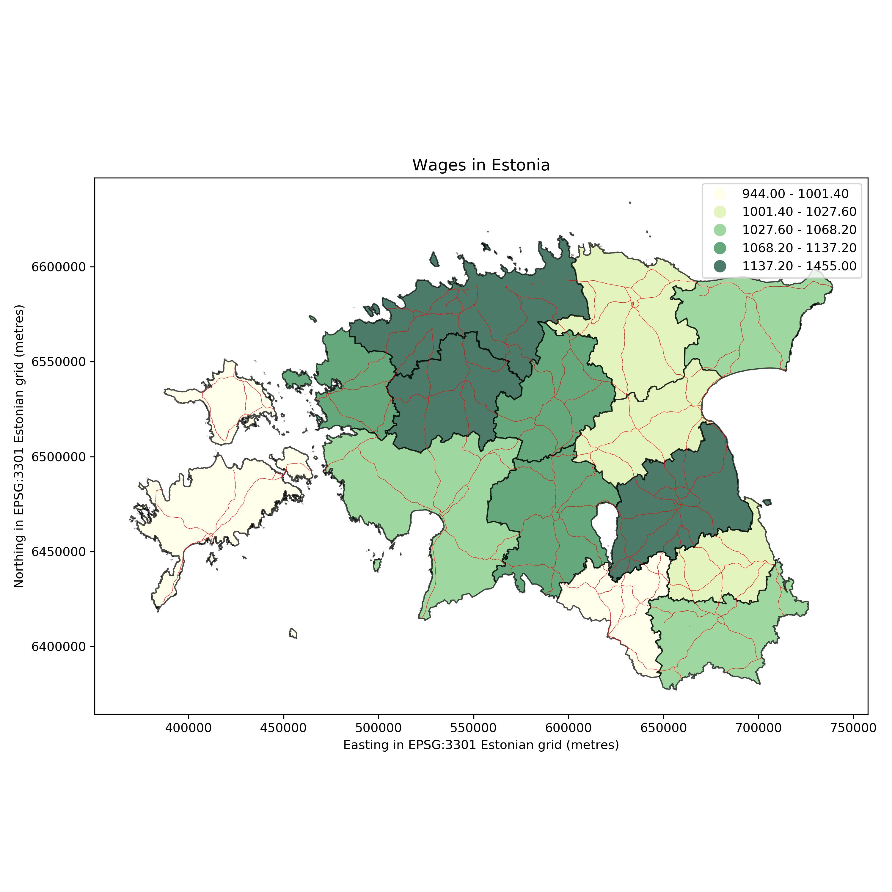
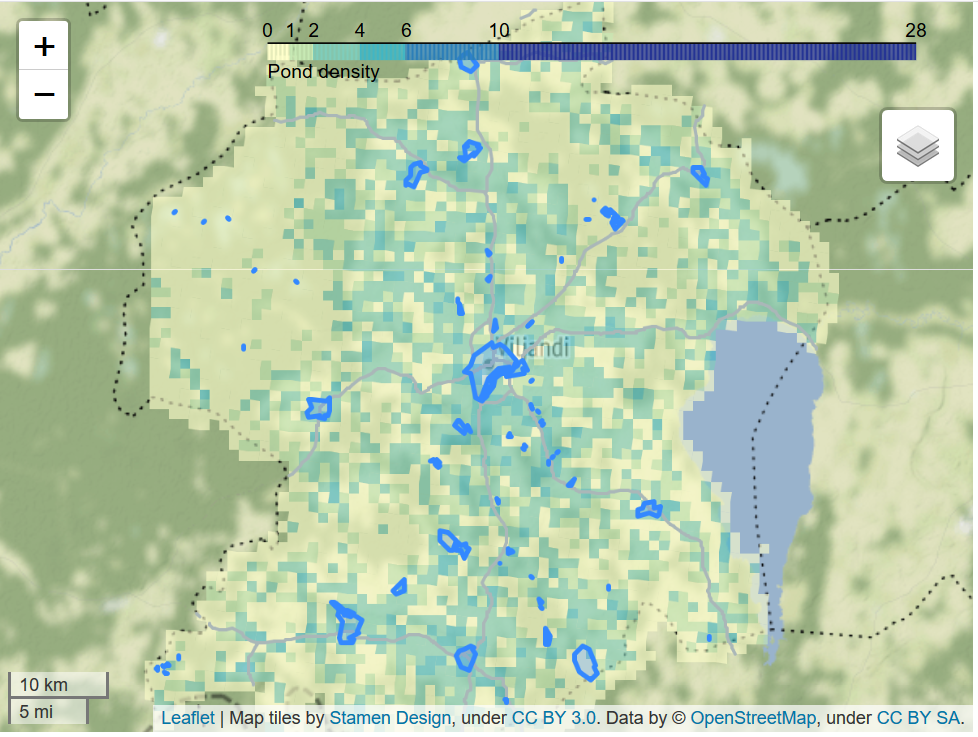
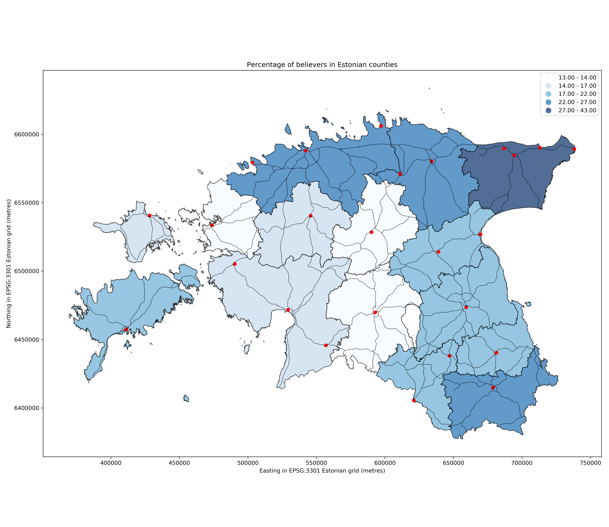

Examples
========

Examples from 2019 course
-------------------------

Safwan Othman: Cost distance for ambulance in Estonia

Ago Tominga: Heritage buildings and churches in Estonia in hexdensity

Martin Haamer: Springs per municipality in Estonia

.. image:: ../_static/example_results/cities_of_middle_earth_thomson.png

Patrick Joan Thomson: Cities of Middle Earth

Kristjan Luts: Global export partners of Estonia

`Click here to view interactive version! <https://kodu.ut.ee/~kmoch/geopython2019/_static/example_results/globe_export_partners_estonia_luts.html>`_

Sigrid Paavle: Average wages in  Estonia

Keelia Hallap: Density map of ponds in Viljandi county, Estonia

`Click here to view interactive version! <https://kodu.ut.ee/~kmoch/geopython2019/_static/example_results/ponds_density_estonia_hallap.html>`_

Marje Jõearu: Percentage of religious people/population, Estonia

Examples from 2018 course
-------------------------

`Geopython 2018 examples <https://kodu.ut.ee/~kmoch/geopython2018/lessons/L5/examples_2018.html>`_
