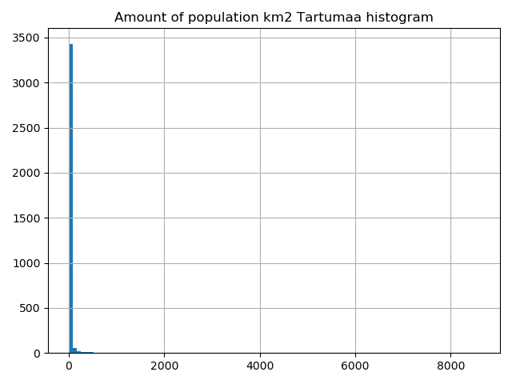
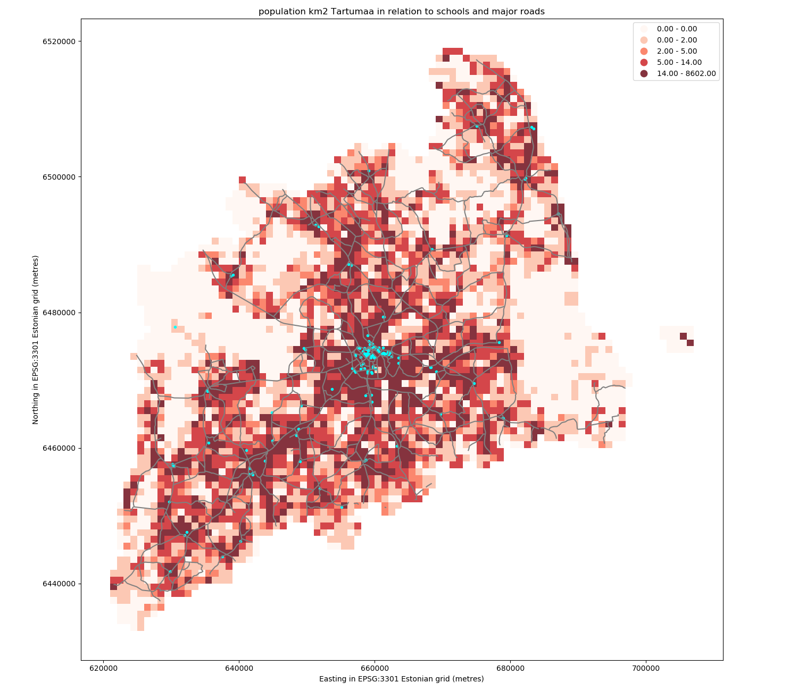

Static maps
===========

Download datasets
-----------------

Before we start you need to download (and then extract) the dataset zip-package used during this lesson `from this link <../_static/data/L6/L6.zip>`_.

You should have following Shapefiles in the ``Data`` folder:

  - population_square_km.shp
  - schools_tartu.shp
  - roads.shp

.. code::

    population_square_km.shp.xml  schools_tartu.cpg
    population_square_km.shx      schools_tartu.csv
    roads.cpg                     schools_tartu.dbf
    roads.dbf                     schools_tartu.prj
    L6.zip                        roads.prj                     schools_tartu.sbn
    roads.sbn                     schools_tartu.sbx
    roads.sbx                     schools_tartu.shp             schools5.csv
    population_square_km.cpg      roads.shp                     schools_tartu.shp.xml
    population_square_km.dbf      roads.shp.xml                 schools_tartu.shx
    population_square_km.prj      roads.shx                     schools_tartu.txt.xml
    population_square_km.sbn
    population_square_km.sbx
    population_square_km.shp

Static maps in Geopandas
------------------------

We have already seen during the previous lessons quite many examples how to create static maps using Geopandas.

Thus, we won't spend too much time repeating making such maps but let's create a one with more layers on it than just one
which kind we have mostly done this far.

Let's create a static accessibility map with roads and schools line on it.

First, we need to read the data.

.. ipython:: python

    import geopandas as gpd
    import matplotlib.pyplot as plt

    # Filepaths
    grid_fp = "source/_static/data/L6/population_square_km.shp"
    roads_fp = "source/_static/data/L6/roads.shp"
    schools_fp = "source/_static/data/L6/schools_tartu.shp"

    # Read files
    grid = gpd.read_file(grid_fp)
    roads = gpd.read_file(roads_fp)
    schools = gpd.read_file(schools_fp)

Then, we need to be sure that the files are in the same coordinate system. Let's use the crs of our travel time grid.

.. ipython:: python

    gridCRS = grid.crs
    roads['geometry'] = roads['geometry'].to_crs(crs=gridCRS)
    schools['geometry'] = schools['geometry'].to_crs(crs=gridCRS)

Finally we can make a visualization using the ``.plot()`` -function in Geopandas. The ``.plot()`` function takes all the matplotlib parameters where appropriate.
For example we can adjust various parameters

- ``ax`` if used, then can indicate a joint plot axes onto which to plot, used to plot several times (several layers etc) into the same plot (using the same axes, i.e. x and y coords)
- ``column`` which dataframe column to plot
- ``linewidth`` if feature with an outline, or being a line feature then line width
- ``markersize`` size of point/marker element to plot
- ``color`` colour for the layers/feature to plot
- ``cmap`` `colormaps (*cmap* - parameter) <https://matplotlib.org/users/colormaps.html#grayscale-conversion>`_
- ``alpha`` transparency  0-1
- ``legend`` True/False show the legend
- ``scheme`` one of 3 basic classification schemes ("quantiles", "equal_interval", "fisher_jenks"), beyond that use PySAL explicitly
- ``k`` number of classes for above scheme if used.
- `` vmin`` indicate a minimal value from the data column to be considered when plotting (also affects the classification scheme), can be used to "normalise" several plots where the data values don't aligh exactly
- `` vmax`` indicate a maximal value from the data column to be considered when plotting (also affects the classification scheme), can be used to "normalise" several plots where the data values don't aligh exactly

.. code::

    # in Jupyter Notebook don't forget to enable the inline plotting magic
    import matplotlib.pyplot as plt
    %matplotlib inline

Let's check the histgram first:

.. ipython:: python

    # Plot
    grid.hist(column="Population", bins=100)
    # Add title
    plt.title("Amount of population km2 Tartumaa histogram")
    @savefig population_histogram2.png width=7in
    plt.tight_layout()

.. ipython:: python
    
    fig, ax = plt.subplots(figsize=(15, 13))
    # Visualize the population density into 5 classes using "Quantiles" classification scheme
    # Add also a little bit of transparency with `alpha` parameter
    # (ranges from 0 to 1 where 0 is fully transparent and 1 has no transparency)
    grid.plot(column="Population", ax=ax, linewidth=0.03, cmap="Reds", scheme="quantiles", k=5, alpha=0.8, legend=True)

    # Add roads on top of the grid
    # (use ax parameter to define the map on top of which the second items are plotted)
    roads.plot(ax=ax, color="grey", linewidth=1.5)

    # Add schools on top of the previous map
    schools.plot(ax=ax, color="cyan", markersize=9.0)

    # Remove the empty white-space around the axes
    plt.title("population km2 Tartumaa in relation to schools and major roads")
    ax.set_ylabel('Northing in EPSG:3301 Estonian grid (metres)')
    ax.set_xlabel('Easting in EPSG:3301 Estonian grid (metres)')
    @savefig static_map.png width=7in
    plt.tight_layout()

.. code::

    outfp = "static_map.png"
    plt.savefig(outfp, dpi=300)

This kind of approach can be used really effectively to produce large quantities of nice looking maps
(*though this example of ours isn't that pretty yet, but it could be*) which is one of the most useful aspects
of coding and what makes it so important to learn how to code.

.. todo::

   **Task:**

   Try to change your plotting parameters, colors and colormaps and see how your results change!
   Change the order of plotting the layers and vector plotting criteria and see how they change the results.

