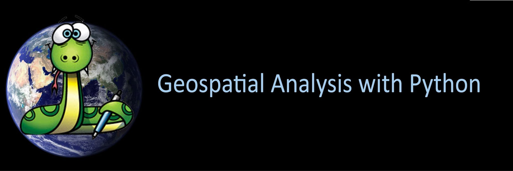
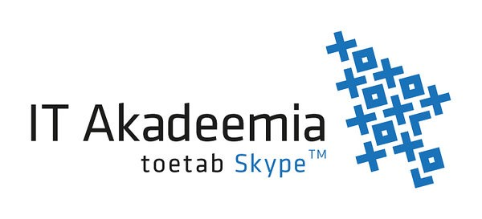

Welcome to Geospatial Analysis with Python and R 2019 (the Python part)
=======================================================================

**Geospatial Analysis with Python**: The course teaches you how to do different GIS-related tasks in the Python programming language. Each lesson is a tutorial with specific topic(s) where the aim is to learn
how to solve common GIS-related problems and tasks using Python tools. In the lessons we use only publicly available data which can be used and downloaded by anyone anywhere.
In this course, we assume that you know the basics of Python programming - but we will also repeat Python basics in order to refresh everyone's memory.

**Synopsis**

To understand and explore the benefits of using a non-gui (coding/scripting) approach to method development for spatial analytics and statistics, based on the standard approaches of widely used and integrated scripting environments (Python and R).

This is an introductory course on concepts, skills, and tools for working with the Python and R scripting environments.
Obtain acquaintanceship with practical Python and R libraries for everyday scientific and professional GIS use, with a focus on automating different standard GIS-related tasks that support clear documentation of methods and productivity.
These lessons assume no prior knowledge of the skills or tools. It is a hands-on teaching course, so the majority of this course will be together in front of a computer and working on exercises.

Course format
-------------

The majority of this course will be spent in front of a computer learning to program in the Python language and working on exercises.

The computer exercises will focus on developing basic programming skills using the Python language and applying those skills to various GIS related problems.
Typical exercises will involve a brief introduction followed by topical computer-based tasks. At the end of the exercises, you may be asked to submit answers
to relevant questions, some related plots, and/or Python codes you have written or used. You are encouraged to discuss and work together with other students
on the laboratory exercises, however the independent assignment write-ups that you submit must be completed individually and must clearly reflect your own work.

.. admonition:: Open Access!

    The aim of this course is to share the knowledge and help people to get started with their journey for doing GIS more efficiently and in a reproducible manner
    using Python programming.

    Read more about open licensing terms from `here <course-info/License-terms.html>`_.

Course topics
-------------

The materials are divided into several sections:

=============  =====
Lesson         Theme
=============  =====
**Lesson 0**   Setup Miniconda environments and Jupyter Notebooks;
               Recap Getting started Python;
**Lesson 1**   Spatial data model;
               Geometric Objects; Shapely
**Lesson 2**   Working with GeoDataFrames;
               Managing projections;
**Lesson 3**   making spatial queries
               and joins;
**Lesson 4**   Working with raster data
**Lesson 5**   Reclassifying data with Pysal
**Lesson 6**   Visualization, making static
               and interactive maps;
=============  =====

Contents
--------
*Lesson content, readings and due dates are subject to change*

**We will make more contents visible during the course**

.. toctree::
   :maxdepth: 2
   :caption: Course information
   
   course-info/Intro-Python-GIS
   course-info/course-info
   course-info/License-terms

.. toctree::
   :maxdepth: 2
   :caption: Lesson 0

   L0/overview
   L0/Installing_Miniconda_GIS
   L0/alt_install_miniconda
   L0/test_installation
   L0/recap-python

.. commented out
   :maxdepth: 2
   :caption: Lesson 1
   
   L1/overview
   L1/Geometric-Objects
   L1/exercise
   L1/exercise-hints

.. commented out
   :caption: Lesson 2
   L2/overview
   L2/Introduction-GIT
   L2/spyder-ide
   L2/geopandas-basics
   L2/projections
   L2/ex-2
   L2/exercise-2-hints

.. commented out
   L2/more-git-hints
   L2/lecture

.. commented out
   :caption: Lesson 3
   L3/overview
   L3/point-in-polygon
   L3/spatial-join

.. commented out
   L3/ex-3
   L3/exercise-3-hints
   L3/geocoding
   L3/nearest-neighbour
   L3/lecture

.. commented out
   :caption: Lesson 4
   L4/overview
   L4/reclassify
   L4/gmaps-heatmap
   L4/ex-4
   L4/exercise-4-hints

.. commented out
   L4/geometric-operations
   L4/lecture

.. commented out
   :caption: Lesson 5
   L5/overview
   L5/static-maps
   L5/interactive-map-bokeh
   L5/interactive-map-folium
   L5/ex-5
   L5/exercise-5-hints
   L5/examples_2018

.. commented out
   L5/advanced-bokeh
   L5/World-3D
   L5/share-on-github
   L5/lecture

Acknowledgments
---------------

Supported by projects and funding from IT-Akadeemia

HITSA

H2020 MSCA IF

ETAG Mobilitas Pluss

